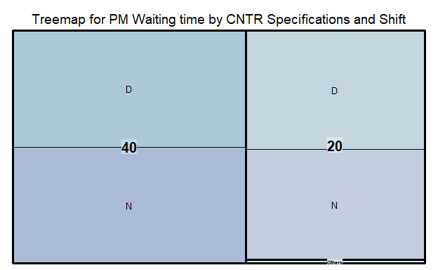
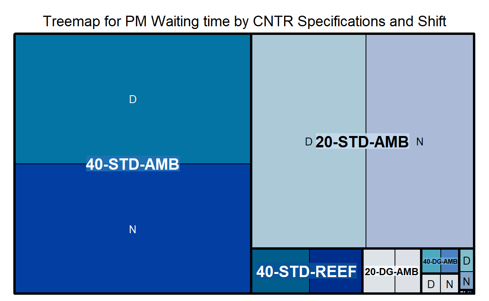
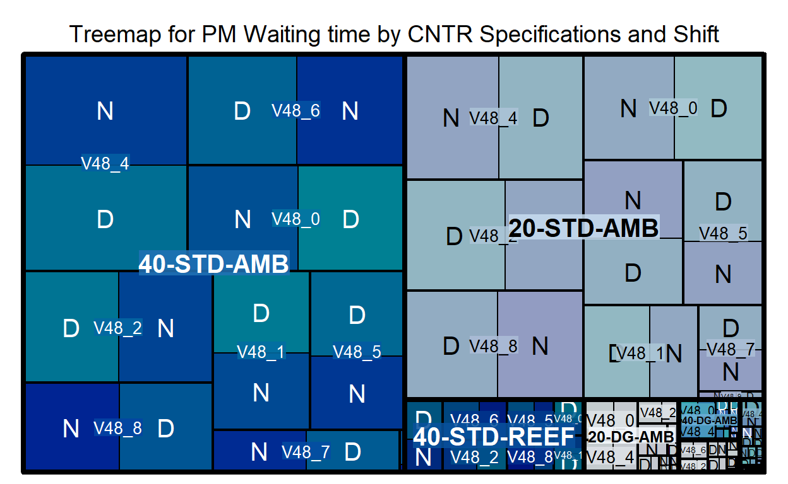
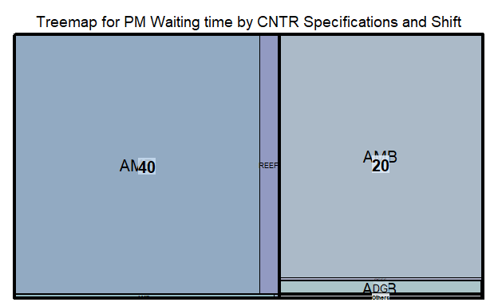
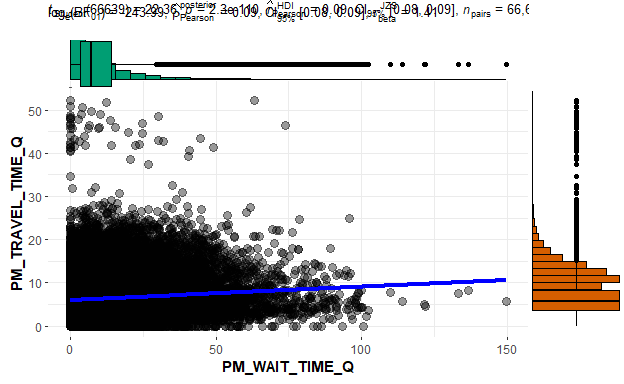
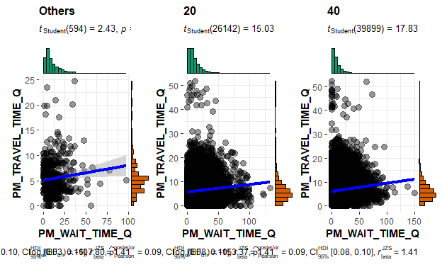
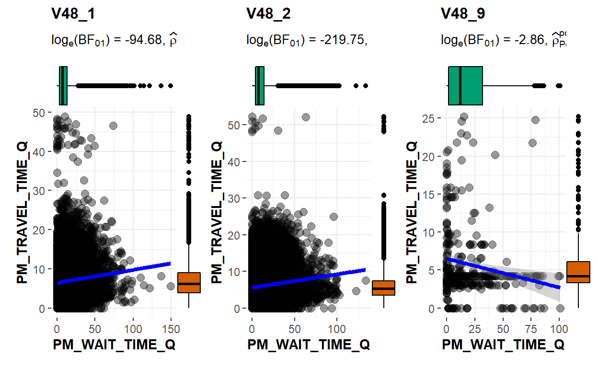
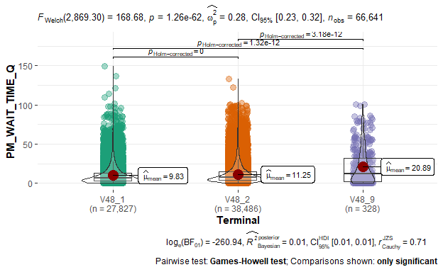
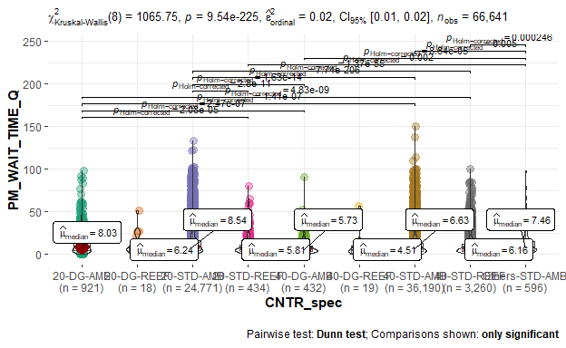
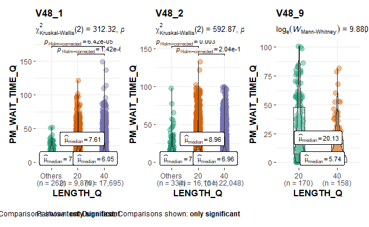

<div class="layout-chunk" data-layout="l-body">
<div class="sourceCode"><pre><code><span class='fu'>knitr</span><span class='fu'>::</span><span class='va'><a href='https://rdrr.io/pkg/knitr/man/opts_chunk.html'>opts_chunk</a></span><span class='op'>$</span><span class='fu'>set</span><span class='op'>(</span>warning<span class='op'>=</span> <span class='cn'>FALSE</span>, message <span class='op'>=</span> <span class='cn'>FALSE</span><span class='op'>)</span>
</code></pre></div>

</div>


# 1.0 Introduction

This assignment is a subset of the bigger Shiny-based Visual Analytics Application project. This is a subset of Understanding Prime Mover (PM) Waiting Time in Yard.

In this markdown blog, there will be 3 components
1) Introduction & Literature Review
2) Exploratory data analysis via treemaps, pie / bar charts, and histograms
3) Uncertainty via confidence intervals with box / violin plots

# 2.0 Introduction & Literature Review


## 2.1 Introduction

Maritime trade has been the backbone of international trade as it accounts approximately 92% of world trade ([Xu, et al, 2020](https://royalsocietypublishing.org/doi/10.1098/rsos.200386)). In terms of value, global seaborne container trade approximately accounts for 60% of world seaborne trade, equivalent to 7.2 trillion US dollars out of 12 trillion US dollars ([Statista, 2020](https://www.statista.com/topics/1367/container-shipping/)). 
As the world's busiest transshipment port, PSA Singapore handles about one-seventh of the world's transshipped containers. In 2020, PSA Singapore and its container terminals handled 36.6 million TEUs (twenty foot equivalent units) of containers ([PSA,2020](https://www.singaporepsa.com/about-us)). Upon a vessel’s arrival at a berth in the container terminal, containers are discharged from and loaded onto it. A typical discharging operation starts with a quay crane picking up a container from the vessel and placing it onto a prime mover (PM), which will then transport the container to a storage yard. At the yard, a yard crane picks up the container from the PM and shifts it to a designated spot. Loading operations involve the transporting of containers in the opposite direction, from the yard to the vessel ([Ku, 2018](https://www.scs.org.sg/articles/how-arti-cial-intelligence-can-make-our-port-smarter)).

Due to the complexity and volume of PSA operations, small productivity gains can bring about large savings to the PSA organisation. Approximately *91,000* PM  actions are carried out on an average day in the port. Assuming 10 seconds are saved for each action, this is equivalent to 252 manhours saved per day, or approximately 92,000 hours saved annually. 

## 2.2 Literature Review

Current literature mainly focuses on yard crane productivity [(Li, et al, n.d.)](https://www.pomsmeetings.org/confpapers/005/005-0094.doc) or optimising the number of PMs and trucks to reduce average PM waiting time [(Staats, n.d.)](https://www.pomsmeetings.org/confpapers/005/005-0094.doc). These previous studies do not focus on existing operations and the various factors, such as the type of containers, dangerous goods containers, and time of day, which may contribute to waiting time. Considering that travel time is fixed due to the speed limit of the prime mover, more emphasis should be used to determine the factors that might cause waiting time, as waiting time is a non-value adding activity.   

Current PSA dashboards and visuliasations were created many years ago and have not been recently updated. These visualisations are high level visualisations that aggregate the data into an average productivity by PM faceted by Terminal ID. 

This first graph showcases the average PM productivity across all terminals. 

{width=100px}

The details of each movement has been lost in the aggregation. Only a simple average is present. There are also no counts being presented in the current visualisation, thus, the user cannot check the total number of movements within the dataset. As terminals operate independently of each other, productivity across terminals are not related, therefore it makes little sense to visualise the productivity values as a line graph. There is no legend to describe what each line represents (red = ship ops, orange / purple = ITH, blue = shifting, black = overall). Colours are inconsistent, as different colours represent the same type of movement.  


{width=100px}

The percentage for each component of the stacked bar chart is not shown, leaving the reader to figure out the approximate percentage of each productivity category. As this view is too aggregated, there is limited possibility of deriving insights from why different terminals are performing differently. Every observation is based on a simple average of productivities. 

{width=100px}

The categories are too wide in this view, considering that the <15 category takes up to at least 75% of movements in each terminal. More granularity should be introduced, with more categories such as "0-5", "5-10", and "10-15", which would give a better breakdown of waiting time. 

Overall, there is no statistical analysis or clear visualisations being put in place in current operations. There are also no parameters that can be adjusted to suit the specific user, with only a one-size-fits-all visualisation available. 

# 3.0 Prototyping
The main goal for the assignment is to explore various R packages and visual designs to determine what will be retained in the final Shiny environment. Due to the size of the dataset, only a section of data will be used from the full dataset to improve performance and reliability. 

## 3.1 Data Preparation

Firstly, to prepare the data that we will be using for experimentation. Data from March 2019 is extracted from the PSA operations database. This database is anonymised using JMP Pro 15. R Packages are loaded with the following code for preparation.  


<div class="layout-chunk" data-layout="l-body">
<div class="sourceCode"><pre><code><span class='co'># Preparing packages</span>
<span class='va'>packages</span> <span class='op'>=</span> <span class='fu'><a href='https://rdrr.io/r/base/c.html'>c</a></span><span class='op'>(</span><span class='st'>"tidyverse"</span>, <span class='st'>"ggstatsplot"</span>, <span class='st'>"ggpubr"</span>, <span class='st'>"corrplot"</span>,<span class='st'>"heatmaply"</span>, <span class='st'>"dendextend"</span>, <span class='st'>"seriation"</span>, <span class='st'>"readr"</span> , <span class='st'>"parallelPlot"</span>, <span class='st'>"treemap"</span>, <span class='st'>"ggthemes"</span>, <span class='st'>"RColorBrewer"</span>, <span class='st'>"forcats"</span>, <span class='st'>"GGally"</span>, <span class='st'>"viridis"</span>, <span class='st'>"parallelPlot"</span>, <span class='st'>"plotly"</span>, <span class='st'>"lubridate"</span>, <span class='st'>"d3treeR"</span>, <span class='st'>"knitr"</span>, <span class='st'>"htmlwidgets"</span>, <span class='st'>"htmltools"</span><span class='op'>)</span>

<span class='kw'>for</span> <span class='op'>(</span><span class='va'>p</span> <span class='kw'>in</span> <span class='va'>packages</span><span class='op'>)</span><span class='op'>{</span>
    <span class='kw'>if</span><span class='op'>(</span><span class='op'>!</span><span class='kw'><a href='https://rdrr.io/r/base/library.html'>require</a></span><span class='op'>(</span><span class='va'>p</span>, character.only <span class='op'>=</span> <span class='cn'>T</span><span class='op'>)</span><span class='op'>)</span><span class='op'>{</span>
        <span class='fu'><a href='https://rdrr.io/r/utils/install.packages.html'>install.packages</a></span><span class='op'>(</span><span class='va'>p</span><span class='op'>)</span>
    <span class='op'>}</span>
    <span class='kw'><a href='https://rdrr.io/r/base/library.html'>library</a></span><span class='op'>(</span><span class='va'>p</span>, character.only <span class='op'>=</span> <span class='cn'>T</span><span class='op'>)</span>
<span class='op'>}</span>
</code></pre></div>

</div>


The data is read and stored as a variable "PM" using the `read_delim()` function of the readr package. `glimpse` from the tidyverse package is used to check which variables need to be transformed or cleaned. 

<div class="layout-chunk" data-layout="l-body">
<div class="sourceCode"><pre><code><span class='co'># Reading the csv file</span>
<span class='va'>PM</span> <span class='op'>&lt;-</span> <span class='fu'>read_delim</span><span class='op'>(</span><span class='st'>"data/PM_201903.txt"</span>, delim <span class='op'>=</span> <span class='st'>","</span><span class='op'>)</span>

<span class='co'># Inspecting the file structure</span>
<span class='fu'>glimpse</span><span class='op'>(</span><span class='va'>PM</span><span class='op'>)</span>
</code></pre></div>

```
Rows: 5,327,083
Columns: 35
$ SHIFT_D          <dbl> 20190330, 20190330, 20190330, 20190330, 201~
$ Terminal_ID      <chr> "V2_0", "V2_0", "V2_0", "V2_0", "V2_0", "V2~
$ PM_N             <chr> "V3_0", "V3_0", "V3_0", "V3_0", "V3_0", "V3~
$ Chassis_N        <chr> "V4_0", "V4_0", "V4_0", "V4_0", "V4_0", "V4~
$ PM_Driver_IC_N   <chr> "V5_0", "V5_0", "V5_0", "V5_0", "V5_0", "V5~
$ EVENT_C          <chr> "DISC", "EQOF", "DISC", "EQOF", "DISC", "DI~
$ EVENT_DT         <chr> "2019/03/30 2:06:59.000 pm", "2019/03/30 2:~
$ EVENT_SHIFT_I    <chr> "D", "D", "D", "D", "D", "D", "D", "N", "N"~
$ MOVE_OP_C        <chr> "O", "O", "O", "O", "O", "O", "O", "O", "O"~
$ CNTR_N           <chr> "V17_0", "V17_0", "V17_1", "V17_1", "V17_2"~
$ LENGTH_Q         <chr> "40", "40", "40", "40", "40", "20", "20", "~
$ CNTR_TYPE_C      <chr> "GP", "GP", "RF", "RF", "GP", "GP", "GP", "~
$ CAT_C            <chr> "HC", "HC", "HR", "HR", "GP", "GP", "GP", "~
$ PURP_C           <chr> "I", "I", "T", "T", "T", "T", "T", "T", "T"~
$ CNTR_ST_C        <chr> "F", "F", "F", "F", "F", "F", "F", "F", "F"~
$ CNTR_OPR_C       <chr> "V25_0", "V25_0", "V25_1", "V25_1", "V25_2"~
$ DG_I             <chr> "N", "N", "N", "N", "N", "N", "N", "N", "N"~
$ REEFER_I         <chr> "N", "N", "Y", "Y", "N", "N", "N", "N", "N"~
$ UC_I             <chr> "N", "N", "N", "N", "N", "N", "N", "N", "N"~
$ OVER_SIZE_I      <chr> "N", "N", "N", "N", "N", "N", "N", "N", "N"~
$ DG_GROUP_C       <chr> "NULL", "NULL", "NULL", "NULL", "NULL", "NU~
$ DG_IMO_CLASS_C   <chr> "NULL", "NULL", "NULL", "NULL", "NULL", "NU~
$ Equipment_N      <chr> "V42_0", "V42_1", "V42_2", "V42_3", "V42_0"~
$ EQUIPMENT_TYPE_C <chr> "QC", "RMG", "QC", "RMG", "QC", "QC", "RMG"~
$ Opr_User_ID      <chr> "V44_0", "V44_1", "V44_2", "V44_1", "V44_0"~
$ Terminal         <chr> "V48_0", "V48_0", "V48_0", "V48_0", "V48_0"~
$ `Berth/BLK`      <chr> "V49_0", "V49_1", "V49_2", "V49_3", "V49_0"~
$ `SLOT/ROW`       <chr> "V50_0", "V50_1", "V50_0", "V50_2", "V50_0"~
$ PM_DISTANCE_Q    <dbl> 545, 740, 705, 750, 1060, 0, 2082, 415, 390~
$ PM_TRAVEL_TIME_Q <dbl> 2.18, 2.96, 2.82, 3.00, 3.13, 0.00, 8.33, 1~
$ PM_WAIT_TIME_Q   <dbl> 3.09, 3.49, 9.48, 17.40, 0.00, 0.00, 15.89,~
$ PM_TIME_DIFF_Q   <dbl> 5.27, 6.45, 12.30, 20.40, 3.13, 0.00, 24.22~
$ BATCH_ID         <dbl> 20190330, 20190330, 20190330, 20190330, 201~
$ LOGON_DT         <chr> "2019/03/30 10:29:41.000 am", "2019/03/30 1~
$ LOGOFF_DT        <chr> "2019/03/30 5:39:35.000 pm", "2019/03/30 5:~
```

</div>

The dataset is filtered using pipes from the tidyverse package, filtering out the events "EQMT", equipment mount to PM from yard crane, and "EQOF", equipment offload from PM to yard crane, respectively. The other movement types in the dataset are miscellaneous movements. The `ymd_hms`, `date`, and `hour` functions from the lubridate package is used to transform the original string data in EVENT_DT to the correct datetime format. Only EVENT_DT was transformed as log-on or log-off time is irrelevant to the analysis. 

<div class="layout-chunk" data-layout="l-body">
<div class="sourceCode"><pre><code><span class='co'># Ensuring that data is in the correct format</span>
<span class='va'>PM</span> <span class='op'>&lt;-</span> <span class='va'>PM</span> <span class='op'>%&gt;%</span> 
  <span class='fu'><a href='https://rdrr.io/r/stats/filter.html'>filter</a></span><span class='op'>(</span><span class='va'>EVENT_C</span> <span class='op'>==</span> <span class='st'>"EQMT"</span> <span class='op'>|</span> <span class='va'>EVENT_C</span> <span class='op'>==</span> <span class='st'>"EQOF"</span><span class='op'>)</span>


<span class='va'>PM</span><span class='op'>$</span><span class='va'>EVENT_DT</span> <span class='op'>&lt;-</span> <span class='fu'>ymd_hms</span><span class='op'>(</span><span class='va'>PM</span><span class='op'>$</span><span class='va'>EVENT_DT</span><span class='op'>)</span>
<span class='va'>PM</span><span class='op'>$</span><span class='va'>day</span> <span class='op'>&lt;-</span> <span class='fu'><a href='https://rdrr.io/r/base/date.html'>date</a></span><span class='op'>(</span><span class='va'>PM</span><span class='op'>$</span><span class='va'>EVENT_DT</span><span class='op'>)</span>
<span class='va'>PM</span><span class='op'>$</span><span class='va'>hour</span> <span class='op'>&lt;-</span> <span class='fu'>hour</span><span class='op'>(</span><span class='va'>PM</span><span class='op'>$</span><span class='va'>EVENT_DT</span><span class='op'>)</span>
</code></pre></div>

</div>


The dataset is transformed and aggregated and grouped with the tidyverse package, according to the variables that we want to explore further.  A `summarise_if` function is used to sum up the numeric variables. `glimpse` is used to check the variables again.

<div class="layout-chunk" data-layout="l-body">
<div class="sourceCode"><pre><code><span class='co'>## aggregating waiting time </span>

<span class='va'>PM_AGG</span> <span class='op'>&lt;-</span> <span class='va'>PM</span> <span class='op'>%&gt;%</span>
  <span class='fu'>group_by</span><span class='op'>(</span><span class='va'>Terminal</span>, <span class='va'>PM_N</span>, <span class='va'>EVENT_SHIFT_I</span>, <span class='va'>MOVE_OP_C</span>, <span class='va'>LENGTH_Q</span>, <span class='va'>CNTR_TYPE_C</span>, <span class='va'>DG_I</span>, <span class='va'>REEFER_I</span>, <span class='va'>OVER_SIZE_I</span>, <span class='va'>EQUIPMENT_TYPE_C</span>, <span class='va'>day</span>, <span class='va'>hour</span><span class='op'>)</span> <span class='op'>%&gt;%</span>
  <span class='fu'>summarise_if</span><span class='op'>(</span><span class='va'>is.numeric</span>, <span class='va'>sum</span><span class='op'>)</span> <span class='op'>%&gt;%</span>
  <span class='fu'>ungroup</span><span class='op'>(</span><span class='op'>)</span>

<span class='fu'>glimpse</span><span class='op'>(</span><span class='va'>PM_AGG</span><span class='op'>)</span>
</code></pre></div>

```
Rows: 1,862,748
Columns: 18
$ Terminal         <chr> "V48_0", "V48_0", "V48_0", "V48_0", "V48_0"~
$ PM_N             <chr> "V3_0", "V3_0", "V3_0", "V3_0", "V3_0", "V3~
$ EVENT_SHIFT_I    <chr> "D", "D", "D", "D", "D", "D", "D", "D", "D"~
$ MOVE_OP_C        <chr> "C", "C", "C", "C", "O", "O", "O", "O", "O"~
$ LENGTH_Q         <chr> "20", "20", "40", "40", "20", "20", "20", "~
$ CNTR_TYPE_C      <chr> "GP", "GP", "GP", "GP", "GP", "GP", "GP", "~
$ DG_I             <chr> "N", "N", "N", "N", "N", "N", "N", "N", "N"~
$ REEFER_I         <chr> "N", "N", "N", "N", "N", "N", "N", "N", "N"~
$ OVER_SIZE_I      <chr> "N", "N", "N", "N", "N", "N", "N", "N", "N"~
$ EQUIPMENT_TYPE_C <chr> "RMG", "RMG", "RMG", "RMG", "FTR", "FTR", "~
$ day              <date> 2019-03-17, 2019-03-17, 2019-03-17, 2019-0~
$ hour             <int> 10, 11, 8, 16, 15, 12, 13, 12, 12, 13, 11, ~
$ SHIFT_D          <dbl> 40380634, 20190317, 20190317, 20190325, 201~
$ PM_DISTANCE_Q    <dbl> 2650, 885, 5241, 5014, 1230, 375, 725, 770,~
$ PM_TRAVEL_TIME_Q <dbl> 10.60, 3.54, 20.96, 20.06, 4.92, 1.50, 2.90~
$ PM_WAIT_TIME_Q   <dbl> 21.25, 46.74, 1.54, 1.71, 5.66, 29.67, 9.68~
$ PM_TIME_DIFF_Q   <dbl> 31.85, 50.28, 12.72, 21.77, 10.58, 31.17, 1~
$ BATCH_ID         <dbl> 40380634, 20190317, 20190317, 20190325, 201~
```

</div>


The dataset is then cleaned and transformed. `as.Date` is used to change "day" to a date. `as.factor` to transform the other character inputs into factors. `fct_collapse` from the forcats function is used to combine, clean, and rename the categories in the dataset. This is to reduce the number of NULLs and zeros within the dataset. It also helps to make many of the variables, such as DG or Reefer, into binary categories. 

An additional variable was created, called "CNTR_spec" to combine the container length, DG status, and Reefer status into 1 factor. These 3 variables can generally describe the condition of most containers that PSA handles. A final `glimpse` is used to confirm the statuses of the variables. 

<div class="layout-chunk" data-layout="l-body">
<div class="sourceCode"><pre><code><span class='co'>## cleaning</span>
<span class='va'>PM_AGG</span><span class='op'>$</span><span class='va'>day</span> <span class='op'>&lt;-</span> <span class='fu'><a href='https://rdrr.io/r/base/as.Date.html'>as.Date</a></span><span class='op'>(</span><span class='va'>PM_AGG</span><span class='op'>$</span><span class='va'>day</span><span class='op'>)</span>

<span class='va'>PM_AGG</span><span class='op'>[</span>,<span class='fu'><a href='https://rdrr.io/r/base/c.html'>c</a></span><span class='op'>(</span><span class='fl'>1</span><span class='op'>:</span><span class='fl'>11</span><span class='op'>)</span><span class='op'>]</span> <span class='op'>&lt;-</span> <span class='fu'><a href='https://rdrr.io/r/base/lapply.html'>lapply</a></span><span class='op'>(</span><span class='va'>PM_AGG</span><span class='op'>[</span>,<span class='fu'><a href='https://rdrr.io/r/base/c.html'>c</a></span><span class='op'>(</span><span class='fl'>1</span><span class='op'>:</span><span class='fl'>11</span><span class='op'>)</span><span class='op'>]</span>,<span class='va'>as.factor</span><span class='op'>)</span>
<span class='va'>PM_AGG</span><span class='op'>$</span><span class='va'>hour</span> <span class='op'>&lt;-</span> <span class='fu'><a href='https://rdrr.io/r/base/factor.html'>as.factor</a></span><span class='op'>(</span><span class='va'>PM_AGG</span><span class='op'>$</span><span class='va'>hour</span><span class='op'>)</span>

<span class='va'>PM_AGG</span><span class='op'>$</span><span class='va'>DG</span> <span class='op'>&lt;-</span> <span class='fu'>fct_collapse</span><span class='op'>(</span><span class='va'>PM_AGG</span><span class='op'>$</span><span class='va'>DG_I</span>, 
                            DG <span class='op'>=</span> <span class='st'>"Y"</span>,
                            STD <span class='op'>=</span> <span class='fu'><a href='https://rdrr.io/r/base/c.html'>c</a></span><span class='op'>(</span><span class='st'>"N"</span>, <span class='st'>"NULL"</span><span class='op'>)</span><span class='op'>)</span>
<span class='va'>PM_AGG</span><span class='op'>$</span><span class='va'>Reefer</span> <span class='op'>&lt;-</span> <span class='fu'>fct_collapse</span><span class='op'>(</span><span class='va'>PM_AGG</span><span class='op'>$</span><span class='va'>REEFER_I</span>, 
                            REEF <span class='op'>=</span> <span class='st'>"Y"</span>,
                            AMB <span class='op'>=</span> <span class='st'>"N"</span><span class='op'>)</span>
<span class='va'>PM_AGG</span><span class='op'>$</span><span class='va'>LENGTH_Q</span> <span class='op'>&lt;-</span> <span class='fu'>fct_collapse</span><span class='op'>(</span><span class='va'>PM_AGG</span><span class='op'>$</span><span class='va'>LENGTH_Q</span>, 
                            <span class='st'>"20"</span> <span class='op'>=</span> <span class='st'>"20"</span>,
                            <span class='st'>"40"</span> <span class='op'>=</span> <span class='st'>"40"</span>, 
                            <span class='st'>"Others"</span> <span class='op'>=</span> <span class='fu'><a href='https://rdrr.io/r/base/c.html'>c</a></span><span class='op'>(</span><span class='st'>"NULL"</span>, <span class='st'>"00"</span>, <span class='st'>"45"</span><span class='op'>)</span><span class='op'>)</span>
<span class='va'>PM_AGG</span><span class='op'>$</span><span class='va'>OVER_SIZE_I</span> <span class='op'>&lt;-</span> <span class='fu'>fct_collapse</span><span class='op'>(</span><span class='va'>PM_AGG</span><span class='op'>$</span><span class='va'>OVER_SIZE_I</span>, 
                            <span class='st'>"Yes"</span> <span class='op'>=</span> <span class='st'>"Y"</span>,
                            <span class='st'>"No"</span> <span class='op'>=</span> <span class='fu'><a href='https://rdrr.io/r/base/c.html'>c</a></span><span class='op'>(</span><span class='st'>"N"</span>, <span class='st'>"NULL"</span><span class='op'>)</span><span class='op'>)</span>

<span class='co'>## Merging Container specs </span>
<span class='va'>PM_AGG</span><span class='op'>$</span><span class='va'>CNTR_spec</span> <span class='op'>&lt;-</span> <span class='fu'><a href='https://rdrr.io/r/base/paste.html'>paste</a></span><span class='op'>(</span><span class='va'>PM_AGG</span><span class='op'>$</span><span class='va'>LENGTH_Q</span>,<span class='va'>PM_AGG</span><span class='op'>$</span><span class='va'>DG</span>,<span class='va'>PM_AGG</span><span class='op'>$</span><span class='va'>Reefer</span>, sep <span class='op'>=</span> <span class='st'>"-"</span><span class='op'>)</span>
<span class='va'>PM_AGG</span><span class='op'>$</span><span class='va'>CNTR_spec</span> <span class='op'>&lt;-</span> <span class='fu'><a href='https://rdrr.io/r/base/factor.html'>as.factor</a></span><span class='op'>(</span><span class='va'>PM_AGG</span><span class='op'>$</span><span class='va'>CNTR_spec</span><span class='op'>)</span>
<span class='va'>PM_AGG</span><span class='op'>$</span><span class='va'>day</span> <span class='op'>&lt;-</span> <span class='fu'><a href='https://rdrr.io/r/base/date.html'>date</a></span><span class='op'>(</span><span class='va'>PM_AGG</span><span class='op'>$</span><span class='va'>day</span><span class='op'>)</span>

<span class='fu'>glimpse</span><span class='op'>(</span><span class='va'>PM_AGG</span><span class='op'>)</span>
</code></pre></div>

```
Rows: 1,862,748
Columns: 21
$ Terminal         <fct> V48_0, V48_0, V48_0, V48_0, V48_0, V48_0, V~
$ PM_N             <fct> V3_0, V3_0, V3_0, V3_0, V3_0, V3_0, V3_0, V~
$ EVENT_SHIFT_I    <fct> D, D, D, D, D, D, D, D, D, D, D, D, D, D, D~
$ MOVE_OP_C        <fct> C, C, C, C, O, O, O, O, O, O, O, O, O, O, O~
$ LENGTH_Q         <fct> 20, 20, 40, 40, 20, 20, 20, 20, 20, 20, 20,~
$ CNTR_TYPE_C      <fct> GP, GP, GP, GP, GP, GP, GP, GP, GP, GP, GP,~
$ DG_I             <fct> N, N, N, N, N, N, N, N, N, N, N, N, N, N, N~
$ REEFER_I         <fct> N, N, N, N, N, N, N, N, N, N, N, N, N, N, N~
$ OVER_SIZE_I      <fct> No, No, No, No, No, No, No, No, No, No, No,~
$ EQUIPMENT_TYPE_C <fct> RMG, RMG, RMG, RMG, FTR, FTR, FTR, FTR, QC,~
$ day              <date> 2019-03-17, 2019-03-17, 2019-03-17, 2019-0~
$ hour             <fct> 10, 11, 8, 16, 15, 12, 13, 12, 12, 13, 11, ~
$ SHIFT_D          <dbl> 40380634, 20190317, 20190317, 20190325, 201~
$ PM_DISTANCE_Q    <dbl> 2650, 885, 5241, 5014, 1230, 375, 725, 770,~
$ PM_TRAVEL_TIME_Q <dbl> 10.60, 3.54, 20.96, 20.06, 4.92, 1.50, 2.90~
$ PM_WAIT_TIME_Q   <dbl> 21.25, 46.74, 1.54, 1.71, 5.66, 29.67, 9.68~
$ PM_TIME_DIFF_Q   <dbl> 31.85, 50.28, 12.72, 21.77, 10.58, 31.17, 1~
$ BATCH_ID         <dbl> 40380634, 20190317, 20190317, 20190325, 201~
$ DG               <fct> STD, STD, STD, STD, STD, STD, STD, STD, STD~
$ Reefer           <fct> AMB, AMB, AMB, AMB, AMB, AMB, AMB, AMB, AMB~
$ CNTR_spec        <fct> 20-STD-AMB, 20-STD-AMB, 40-STD-AMB, 40-STD-~
```

</div>


As this is a prototype, a date filter was added to the dataset using the `filter` function from tidyverse to reduce the number of data rows being processed to increase processing speed. The final Shiny app would have the entire dataset. Using this method, the number of rows being processed is cut down from 1.7 million entries to approximately 90 thousand. The PM_group dataset  will be the main dataset used in the prototype.  

<div class="layout-chunk" data-layout="l-body">
<div class="sourceCode"><pre><code><span class='va'>PM_AGG</span> <span class='op'>%&gt;%</span> 
  <span class='fu'>group_by</span><span class='op'>(</span><span class='va'>LENGTH_Q</span><span class='op'>)</span> <span class='op'>%&gt;%</span>
  <span class='fu'>tally</span><span class='op'>(</span><span class='op'>)</span>
</code></pre></div>

```
# A tibble: 3 x 2
  LENGTH_Q       n
  <fct>      <int>
1 Others     14351
2 20        731286
3 40       1117111
```

<div class="sourceCode"><pre><code><span class='va'>upper_date</span> <span class='op'>&lt;-</span> <span class='fu'><a href='https://rdrr.io/r/base/date.html'>date</a></span><span class='op'>(</span><span class='st'>"2019-03-05"</span><span class='op'>)</span>
<span class='va'>lower_date</span> <span class='op'>&lt;-</span> <span class='fu'><a href='https://rdrr.io/r/base/date.html'>date</a></span><span class='op'>(</span><span class='st'>"2019-03-02"</span><span class='op'>)</span>

<span class='va'>PM_group</span> <span class='op'>&lt;-</span> <span class='va'>PM_AGG</span> <span class='op'>%&gt;%</span> 
  <span class='fu'><a href='https://rdrr.io/r/stats/filter.html'>filter</a></span><span class='op'>(</span><span class='fu'>between</span><span class='op'>(</span><span class='va'>day</span>, <span class='va'>lower_date</span>, <span class='va'>upper_date</span><span class='op'>)</span><span class='op'>)</span>

<span class='fu'><a href='https://rdrr.io/r/utils/head.html'>head</a></span><span class='op'>(</span><span class='va'>PM_group</span><span class='op'>)</span>
</code></pre></div>

```
# A tibble: 6 x 21
  Terminal PM_N  EVENT_SHIFT_I MOVE_OP_C LENGTH_Q CNTR_TYPE_C DG_I 
  <fct>    <fct> <fct>         <fct>     <fct>    <fct>       <fct>
1 V48_0    V3_0  D             O         20       GP          N    
2 V48_0    V3_0  D             O         20       GP          N    
3 V48_0    V3_0  D             O         20       GP          N    
4 V48_0    V3_0  D             O         20       GP          N    
5 V48_0    V3_0  D             O         20       GP          N    
6 V48_0    V3_0  D             O         20       GP          N    
# ... with 14 more variables: REEFER_I <fct>, OVER_SIZE_I <fct>,
#   EQUIPMENT_TYPE_C <fct>, day <date>, hour <fct>, SHIFT_D <dbl>,
#   PM_DISTANCE_Q <dbl>, PM_TRAVEL_TIME_Q <dbl>,
#   PM_WAIT_TIME_Q <dbl>, PM_TIME_DIFF_Q <dbl>, BATCH_ID <dbl>,
#   DG <fct>, Reefer <fct>, CNTR_spec <fct>
```

<div class="sourceCode"><pre><code><span class='fu'>glimpse</span><span class='op'>(</span><span class='va'>PM_group</span><span class='op'>)</span>
</code></pre></div>

```
Rows: 233,679
Columns: 21
$ Terminal         <fct> V48_0, V48_0, V48_0, V48_0, V48_0, V48_0, V~
$ PM_N             <fct> V3_0, V3_0, V3_0, V3_0, V3_0, V3_0, V3_0, V~
$ EVENT_SHIFT_I    <fct> D, D, D, D, D, D, D, D, D, D, D, D, D, D, D~
$ MOVE_OP_C        <fct> O, O, O, O, O, O, O, O, O, O, O, O, O, O, O~
$ LENGTH_Q         <fct> 20, 20, 20, 20, 20, 20, 20, 20, 20, 20, 40,~
$ CNTR_TYPE_C      <fct> GP, GP, GP, GP, GP, GP, GP, GP, GP, TK, GP,~
$ DG_I             <fct> N, N, N, N, N, N, N, N, N, Y, N, N, N, N, N~
$ REEFER_I         <fct> N, N, N, N, N, N, N, N, N, N, N, N, N, N, N~
$ OVER_SIZE_I      <fct> No, No, No, No, No, No, No, No, No, No, No,~
$ EQUIPMENT_TYPE_C <fct> FTR, RMG, RMG, RMG, RMG, RMG, RMG, RMG, RMG~
$ day              <date> 2019-03-02, 2019-03-02, 2019-03-03, 2019-0~
$ hour             <fct> 15, 13, 11, 12, 18, 7, 8, 12, 13, 12, 8, 13~
$ SHIFT_D          <dbl> 20190302, 20190302, 20190303, 40380606, 201~
$ PM_DISTANCE_Q    <dbl> 1230, 2650, 2220, 3510, 2603, 860, 0, 725, ~
$ PM_TRAVEL_TIME_Q <dbl> 4.92, 10.60, 8.88, 14.04, 10.41, 3.44, 0.00~
$ PM_WAIT_TIME_Q   <dbl> 5.66, 0.07, 2.84, 10.90, 3.39, 18.18, 14.98~
$ PM_TIME_DIFF_Q   <dbl> 10.58, 10.67, 11.72, 24.94, 13.80, 18.38, 1~
$ BATCH_ID         <dbl> 20190302, 20190302, 20190303, 40380606, 201~
$ DG               <fct> STD, STD, STD, STD, STD, STD, STD, STD, STD~
$ Reefer           <fct> AMB, AMB, AMB, AMB, AMB, AMB, AMB, AMB, AMB~
$ CNTR_spec        <fct> 20-STD-AMB, 20-STD-AMB, 20-STD-AMB, 20-STD-~
```

</div>


## 3.2 Exploratory Data Analysis

Exploratory data analysis will be the first component of the Shiny application so as to provide a general overview of the performance and breakdown of PM waiting time.

### 3.2.1 Treemap

One of the issues that the user has with the current visualisations is that there is no form of breakdown for the type of containers or number of containers handled in each terminal. Thus, a treemap was conceptualised as a good way to visualise the size and scale that each factor contributes to the waiting time. The `treemap` function from the treemap package was used to create the visualisations below.


"PM_WAIT_TIME_Q" is used as the base for the size of the category, within the `vSize` argument in the `treemap` function. Initial testing used the variables as strings, such as "LENGTH_Q" being mapped directly for the `index` argument. Further testing allowed for mapping the index directly with variables. These variables are used as a proxy for the R Shiny input values, and can be mapped more easily into the code chunk. However, more testing will need to be carried out to see if a checklist can be used to increase the number of categories being mapped in the treemap at any one time. 

<div class="layout-chunk" data-layout="l-body">
<div class="sourceCode"><pre><code><span class='va'>index1</span> <span class='op'>&lt;-</span> <span class='st'>"LENGTH_Q"</span>
<span class='va'>index2</span> <span class='op'>&lt;-</span>  <span class='st'>"EVENT_SHIFT_I"</span>
<span class='va'>vsize</span> <span class='op'>&lt;-</span> <span class='st'>"PM_WAIT_TIME_Q"</span>


<span class='co'>## treemap for waiting time, group by LENGTH_Q</span>
<span class='va'>tree_len</span> <span class='op'>&lt;-</span> <span class='fu'>treemap</span><span class='op'>(</span><span class='va'>PM_group</span>, index <span class='op'>=</span> <span class='fu'><a href='https://rdrr.io/r/base/c.html'>c</a></span><span class='op'>(</span><span class='va'>index1</span>, <span class='va'>index2</span><span class='op'>)</span>, vSize <span class='op'>=</span> <span class='va'>vsize</span>, palette <span class='op'>=</span> <span class='st'>"Blues"</span>, title <span class='op'>=</span> <span class='st'>"Treemap for PM Waiting time by CNTR Specifications and Shift"</span>, fontsize.labels <span class='op'>=</span> <span class='fu'><a href='https://rdrr.io/r/base/c.html'>c</a></span><span class='op'>(</span><span class='fl'>15</span>,<span class='fl'>10</span><span class='op'>)</span><span class='op'>)</span>
</code></pre></div>
<!-- --><div class="sourceCode"><pre><code><span class='va'>index3</span> <span class='op'>&lt;-</span> <span class='st'>"CNTR_spec"</span>
<span class='co'>## treemap for waiting time, group by terminal ID</span>
<span class='va'>tree_cntr</span> <span class='op'>&lt;-</span> <span class='fu'>treemap</span><span class='op'>(</span><span class='va'>PM_group</span>, index <span class='op'>=</span> <span class='fu'><a href='https://rdrr.io/r/base/c.html'>c</a></span><span class='op'>(</span><span class='va'>index3</span>, <span class='va'>index2</span><span class='op'>)</span>, vSize <span class='op'>=</span> <span class='va'>vsize</span>, palette <span class='op'>=</span> <span class='st'>"Blues"</span>, title <span class='op'>=</span> <span class='st'>"Treemap for PM Waiting time by CNTR Specifications and Shift"</span>, fontsize.labels <span class='op'>=</span> <span class='fu'><a href='https://rdrr.io/r/base/c.html'>c</a></span><span class='op'>(</span><span class='fl'>15</span>,<span class='fl'>10</span><span class='op'>)</span><span class='op'>)</span>
</code></pre></div>
<!-- --><div class="sourceCode"><pre><code><span class='co'>## treemap for waiting time, group by terminal ID</span>

<span class='va'>index4</span> <span class='op'>&lt;-</span> <span class='st'>"Terminal"</span>

<span class='va'>tree_term</span> <span class='op'>&lt;-</span> <span class='fu'>treemap</span><span class='op'>(</span><span class='va'>PM_group</span>, index <span class='op'>=</span> <span class='fu'><a href='https://rdrr.io/r/base/c.html'>c</a></span><span class='op'>(</span><span class='va'>index3</span>, <span class='va'>index4</span>, <span class='va'>index2</span><span class='op'>)</span>, vSize <span class='op'>=</span> <span class='va'>vsize</span>, palette <span class='op'>=</span> <span class='st'>"Blues"</span>, title <span class='op'>=</span> <span class='st'>"Treemap for PM Waiting time by CNTR Specifications and Shift"</span>, fontsize.labels <span class='op'>=</span> <span class='fu'><a href='https://rdrr.io/r/base/c.html'>c</a></span><span class='op'>(</span><span class='fl'>15</span>,<span class='fl'>10</span><span class='op'>)</span><span class='op'>)</span>
</code></pre></div>
<!-- --><div class="sourceCode"><pre><code><span class='co'>## treemap mapping cntr spec </span>
<span class='va'>index5</span> <span class='op'>&lt;-</span> <span class='fu'><a href='https://rdrr.io/r/base/c.html'>c</a></span><span class='op'>(</span><span class='st'>"LENGTH_Q"</span>, <span class='st'>"DG"</span>, <span class='st'>"Reefer"</span><span class='op'>)</span>
<span class='va'>tree_DG</span> <span class='op'>&lt;-</span> <span class='fu'>treemap</span><span class='op'>(</span><span class='va'>PM_group</span>, index <span class='op'>=</span> <span class='va'>index5</span>, vSize <span class='op'>=</span> <span class='va'>vsize</span>, palette <span class='op'>=</span> <span class='st'>"Blues"</span>, title <span class='op'>=</span> <span class='st'>"Treemap for PM Waiting time by CNTR Specifications and Shift"</span>, fontsize.labels <span class='op'>=</span> <span class='fu'><a href='https://rdrr.io/r/base/c.html'>c</a></span><span class='op'>(</span><span class='fl'>15</span>,<span class='fl'>10</span><span class='op'>)</span><span class='op'>)</span>
</code></pre></div>
<!-- -->

</div>


Interactivity is introduced using the `d3tree2` function in the d3treeR package. This helps the user to explore the categories that they are more interested in. One of the treemaps that was created above was mampped into the `d3tree2` function. In the shiny app, this output will be shown below the initial treemap for easy reference.

<div class="layout-chunk" data-layout="l-body">
<div class="sourceCode"><pre><code><span class='va'>treemap_inter</span> <span class='op'>&lt;-</span> <span class='fu'>d3tree2</span><span class='op'>(</span><span class='va'>tree_term</span>, rootname <span class='op'>=</span> <span class='st'>"Container Types"</span><span class='op'>)</span>

<span class='va'>treemap_inter</span>
</code></pre></div>

```{=html}
<div id="htmlwidget-4431b486fa0b0590d008" style="width:624px;height:384px;" class="d3tree2 html-widget"></div>
<script type="application/json" data-for="htmlwidget-4431b486fa0b0590d008">{"x":{"data":{"name":"Container Types","id":1,"size":null,"children":[{"name":"20-DG-AMB","color":"#F7FBFF","h":0.17355062834636,"id":2,"size":66724.71,"stdErr":66724.71,"vColor":4803,"vSize":66724.71,"w":0.128167937301323,"x0":0.757207727171285,"y0":0,"children":[{"name":"V48_0","color":"#DDE3E6","h":0.0971167887071368,"id":3,"size":21085.19,"stdErr":21085.19,"vColor":1262,"vSize":21085.19,"w":0.0723772529799231,"x0":0.757207727171285,"y0":0.076433839639223,"children":[{"name":"D","color":"#C5CDCF","h":0.0971167887071368,"id":4,"size":11671.11,"stdErr":11671.11,"vColor":594,"vSize":11671.11,"w":0.0400623793774924,"x0":0.757207727171285,"y0":0.076433839639223},{"name":"N","color":"#C5CACF","h":0.0971167887071368,"id":5,"size":9414.08,"stdErr":9414.08,"vColor":668,"vSize":9414.08,"w":0.0323148736024307,"x0":0.797270106548777,"y0":0.076433839639223}]},{"name":"V48_1","color":"#DDE2E6","h":0.0379217232826469,"id":6,"size":1663,"stdErr":1663,"vColor":202,"vSize":1663,"w":0.0146191820665866,"x0":0.858520587441102,"y0":0,"children":[{"name":"D","color":"#C5CDCF","h":0.016186396174216,"id":7,"size":709.83,"stdErr":709.83,"vColor":87,"vSize":709.83,"w":0.0146191820665865,"x0":0.858520587441102,"y0":0},{"name":"N","color":"#C5C9CF","h":0.0217353271084309,"id":8,"size":953.17,"stdErr":953.17,"vColor":115,"vSize":953.17,"w":0.0146191820665866,"x0":0.858520587441102,"y0":0.0161863961742161}]},{"name":"V48_2","color":"#DDE2E6","h":0.0576384858770814,"id":9,"size":9646.18,"stdErr":9646.18,"vColor":719,"vSize":9646.18,"w":0.0557906843213999,"x0":0.829584980151208,"y0":0.115912142469278,"children":[{"name":"D","color":"#C5CCCF","h":0.0576384858770814,"id":10,"size":5633.7,"stdErr":5633.7,"vColor":365,"vSize":5633.7,"w":0.0325836733568595,"x0":0.829584980151208,"y0":0.115912142469278},{"name":"N","color":"#C5C9CF","h":0.0576384858770813,"id":11,"size":4012.48,"stdErr":4012.48,"vColor":354,"vSize":4012.48,"w":0.0232070109645405,"x0":0.862168653508067,"y0":0.115912142469278}]},{"name":"V48_4","color":"#DDE1E6","h":0.076433839639223,"id":12,"size":16594.68,"stdErr":16594.68,"vColor":1231,"vSize":16594.68,"w":0.072377252979923,"x0":0.757207727171285,"y0":0,"children":[{"name":"D","color":"#C5CCCF","h":0.076433839639223,"id":13,"size":9043.48,"stdErr":9043.48,"vColor":655,"vSize":9043.48,"w":0.0394428961437565,"x0":0.757207727171285,"y0":0},{"name":"N","color":"#C5C9CF","h":0.076433839639223,"id":14,"size":7551.2,"stdErr":7551.2,"vColor":576,"vSize":7551.2,"w":0.0329343568361664,"x0":0.796650623315042,"y0":0}]},{"name":"V48_5","color":"#DDE1E6","h":0.0779904191866315,"id":15,"size":3653.26,"stdErr":3653.26,"vColor":293,"vSize":3653.26,"w":0.0156155835221773,"x0":0.869760080950431,"y0":0.037921723282647,"children":[{"name":"D","color":"#C5CBCF","h":0.0308472531678322,"id":16,"size":1444.96,"stdErr":1444.96,"vColor":111,"vSize":1444.96,"w":0.0156155835221773,"x0":0.869760080950431,"y0":0.037921723282647},{"name":"N","color":"#C5C8CF","h":0.0471431660187992,"id":17,"size":2208.3,"stdErr":2208.3,"vColor":182,"vSize":2208.3,"w":0.0156155835221773,"x0":0.869760080950431,"y0":0.0687689764504793}]},{"name":"V48_6","color":"#DDE1E6","h":0.0379217232826469,"id":18,"size":3291.56,"stdErr":3291.56,"vColor":291,"vSize":3291.56,"w":0.0289356072898939,"x0":0.829584980151208,"y0":0,"children":[{"name":"D","color":"#C5CBCF","h":0.0379217232826469,"id":19,"size":2062.25,"stdErr":2062.25,"vColor":182,"vSize":2062.25,"w":0.0181289285729514,"x0":0.829584980151208,"y0":0},{"name":"N","color":"#C5C8CF","h":0.037921723282647,"id":20,"size":1229.31,"stdErr":1229.31,"vColor":109,"vSize":1229.31,"w":0.0108066787169425,"x0":0.847713908724159,"y0":0}]},{"name":"V48_7","color":"#DDE0E6","h":0.037921723282647,"id":21,"size":1391.89,"stdErr":1391.89,"vColor":111,"vSize":1391.89,"w":0.0122358949649195,"x0":0.873139769507688,"y0":0,"children":[{"name":"D","color":"#C5CACF","h":0.0177954665932843,"id":22,"size":653.17,"stdErr":653.17,"vColor":58,"vSize":653.17,"w":0.0122358949649194,"x0":0.873139769507688,"y0":0},{"name":"N","color":"#C5C7CF","h":0.0201262566893627,"id":23,"size":738.72,"stdErr":738.72,"vColor":53,"vSize":738.72,"w":0.0122358949649195,"x0":0.873139769507688,"y0":0.0177954665932843}]},{"name":"V48_8","color":"#DDE0E6","h":0.0779904191866315,"id":24,"size":9398.95,"stdErr":9398.95,"vColor":694,"vSize":9398.95,"w":0.0401751007992227,"x0":0.829584980151208,"y0":0.037921723282647,"children":[{"name":"D","color":"#C5CACF","h":0.0468145810729412,"id":25,"size":5641.82,"stdErr":5641.82,"vColor":367,"vSize":5641.82,"w":0.0401751007992227,"x0":0.829584980151208,"y0":0.0690975613963372},{"name":"N","color":"#C5C7CF","h":0.0311758381136903,"id":26,"size":3757.13,"stdErr":3757.13,"vColor":327,"vSize":3757.13,"w":0.0401751007992227,"x0":0.829584980151208,"y0":0.037921723282647}]}]},{"name":"20-DG-REEF","color":"#DEEBF7","h":0.012389768529638,"id":27,"size":560.59,"stdErr":560.59,"vColor":45,"vSize":560.59,"w":0.015083462365238,"x0":0.967753479118666,"y0":0,"children":[{"name":"V48_0","color":"#C3D6DE","h":0.00325429646410081,"id":28,"size":23.6,"stdErr":23.6,"vColor":1,"vSize":23.6,"w":0.00241754061527433,"x0":0.98041940086863,"y0":0.0018836309194753,"children":[{"name":"N","color":"#C3D6DE","h":0.00325429646410081,"id":29,"size":23.6,"stdErr":23.6,"vColor":1,"vSize":23.6,"w":0.00241754061527429,"x0":0.98041940086863,"y0":0.0018836309194753}]},{"name":"V48_1","color":"#C3D4DE","h":0.00448901912954945,"id":30,"size":71.13,"stdErr":71.13,"vColor":6,"vSize":71.13,"w":0.00528226570496,"x0":0.97513713516367,"y0":0,"children":[{"name":"D","color":"#ABC2C8","h":0.00448901912954941,"id":31,"size":11.42,"stdErr":11.42,"vColor":4,"vSize":11.42,"w":0.000848073588508973,"x0":0.979571327280121,"y0":0},{"name":"N","color":"#ABB8C8","h":0.00448901912954945,"id":32,"size":59.71,"stdErr":59.71,"vColor":2,"vSize":59.71,"w":0.00443419211645103,"x0":0.97513713516367,"y0":0}]},{"name":"V48_2","color":"#C3D3DE","h":0.00790074940008851,"id":33,"size":125.19,"stdErr":125.19,"vColor":12,"vSize":125.19,"w":0.00528226570495998,"x0":0.97513713516367,"y0":0.00448901912954945,"children":[{"name":"D","color":"#ABC1C8","h":0.00790074940008839,"id":34,"size":18.58,"stdErr":18.58,"vColor":4,"vSize":18.58,"w":0.000783964348575391,"x0":0.979635436520055,"y0":0.00448901912954967},{"name":"N","color":"#ABB7C8","h":0.00790074940008851,"id":35,"size":106.61,"stdErr":106.61,"vColor":8,"vSize":106.61,"w":0.00449830135638458,"x0":0.97513713516367,"y0":0.00448901912954945}]},{"name":"V48_4","color":"#C3D1DE","h":0.012389768529638,"id":36,"size":274.42,"stdErr":274.42,"vColor":19,"vSize":274.42,"w":0.00738365604500369,"x0":0.967753479118666,"y0":0,"children":[{"name":"D","color":"#ABBFC8","h":0.0123897685296381,"id":37,"size":127.54,"stdErr":127.54,"vColor":9,"vSize":127.54,"w":0.0034316430725886,"x0":0.971705492091081,"y0":0},{"name":"N","color":"#ABB5C8","h":0.012389768529638,"id":38,"size":146.88,"stdErr":146.88,"vColor":10,"vSize":146.88,"w":0.00395201297241509,"x0":0.967753479118666,"y0":0}]},{"name":"V48_5","color":"#C3D0DE","h":0.00188363091947521,"id":39,"size":8.51,"stdErr":8.51,"vColor":2,"vSize":8.51,"w":0.00150609594699738,"x0":0.98041940086863,"y0":0,"children":[{"name":"D","color":"#C3D0DE","h":0.00188363091947521,"id":40,"size":8.51,"stdErr":8.51,"vColor":2,"vSize":8.51,"w":0.00150609594699744,"x0":0.98041940086863,"y0":0}]},{"name":"V48_6","color":"#C3CEDE","h":0.00188363091947533,"id":41,"size":5.15,"stdErr":5.15,"vColor":1,"vSize":5.15,"w":0.000911444668276957,"x0":0.981925496815628,"y0":0,"children":[{"name":"N","color":"#C3CEDE","h":0.00188363091947533,"id":42,"size":5.15,"stdErr":5.15,"vColor":1,"vSize":5.15,"w":0.000911444668276957,"x0":0.981925496815628,"y0":0}]},{"name":"V48_8","color":"#C3CDDE","h":0.00725184114606194,"id":43,"size":52.59,"stdErr":52.59,"vColor":4,"vSize":52.59,"w":0.00241754061527433,"x0":0.98041940086863,"y0":0.00513792738357611,"children":[{"name":"D","color":"#ABBAC8","h":0.00405270224914927,"id":44,"size":29.39,"stdErr":29.39,"vColor":2,"vSize":29.39,"w":0.00241754061527433,"x0":0.98041940086863,"y0":0.00833706628048878},{"name":"N","color":"#ABB0C8","h":0.00319913889691266,"id":45,"size":23.2,"stdErr":23.2,"vColor":2,"vSize":23.2,"w":0.00241754061527429,"x0":0.98041940086863,"y0":0.00513792738357611}]}]},{"name":"20-STD-AMB","color":"#C6DBEF","h":0.82644937165364,"id":46,"size":1202867.3,"stdErr":1202867.3,"vColor":84828,"vSize":1202867.3,"w":0.485199511941554,"x0":0.514800488058446,"y0":0.17355062834636,"children":[{"name":"V48_0","color":"#ABC9D7","h":0.253586295125626,"id":47,"size":185530.49,"stdErr":185530.49,"vColor":14597,"vSize":185530.49,"w":0.243898092225384,"x0":0.756101907774616,"y0":0.746413704874374,"children":[{"name":"D","color":"#92BAC2","h":0.253586295125626,"id":48,"size":92218.73,"stdErr":92218.73,"vColor":7188,"vSize":92218.73,"w":0.121230598347731,"x0":0.878769401652269,"y0":0.746413704874374},{"name":"N","color":"#92AAC2","h":0.253586295125626,"id":49,"size":93311.76,"stdErr":93311.76,"vColor":7409,"vSize":93311.76,"w":0.122667493877653,"x0":0.756101907774616,"y0":0.746413704874374}]},{"name":"V48_1","color":"#ABC7D7","h":0.226248034318328,"id":50,"size":105586.59,"stdErr":105586.59,"vColor":9454,"vSize":105586.59,"w":0.155576085542329,"x0":0.756101907774616,"y0":0.17355062834636,"children":[{"name":"D","color":"#92B8C2","h":0.226248034318328,"id":51,"size":61165.83,"stdErr":61165.83,"vColor":5093,"vSize":61165.83,"w":0.0901245167624746,"x0":0.756101907774616,"y0":0.17355062834636},{"name":"N","color":"#92A8C2","h":0.226248034318328,"id":52,"size":44420.76,"stdErr":44420.76,"vColor":4361,"vSize":44420.76,"w":0.0654515687798541,"x0":0.846226424537091,"y0":0.17355062834636}]},{"name":"V48_2","color":"#ABC5D7","h":0.264657911046652,"id":53,"size":191569.28,"stdErr":191569.28,"vColor":15147,"vSize":191569.28,"w":0.24130141971617,"x0":0.514800488058446,"y0":0.434274962305988,"children":[{"name":"D","color":"#92B6C2","h":0.264657911046652,"id":54,"size":107517.34,"stdErr":107517.34,"vColor":8040,"vSize":107517.34,"w":0.135429264995442,"x0":0.514800488058446,"y0":0.434274962305988},{"name":"N","color":"#92A6C2","h":0.264657911046652,"id":55,"size":84051.94,"stdErr":84051.94,"vColor":7107,"vSize":84051.94,"w":0.105872154720727,"x0":0.650229753053889,"y0":0.434274962305988}]},{"name":"V48_4","color":"#ABC3D7","h":0.30106712664736,"id":56,"size":217923.63,"stdErr":217923.63,"vColor":14939,"vSize":217923.63,"w":0.24130141971617,"x0":0.514800488058446,"y0":0.69893287335264,"children":[{"name":"D","color":"#92B4C2","h":0.30106712664736,"id":57,"size":103177.29,"stdErr":103177.29,"vColor":7007,"vSize":103177.29,"w":0.114245649081134,"x0":0.641856258693482,"y0":0.69893287335264},{"name":"N","color":"#92A4C2","h":0.30106712664736,"id":58,"size":114746.34,"stdErr":114746.34,"vColor":7932,"vSize":114746.34,"w":0.127055770635035,"x0":0.514800488058446,"y0":0.69893287335264}]},{"name":"V48_5","color":"#ABC1D7","h":0.346615042209686,"id":59,"size":112846.82,"stdErr":112846.82,"vColor":6474,"vSize":112846.82,"w":0.108532750581646,"x0":0.891467249418354,"y0":0.399798662664688,"children":[{"name":"D","color":"#92B2C2","h":0.194298425412202,"id":60,"size":63257.38,"stdErr":63257.38,"vColor":3404,"vSize":63257.38,"w":0.108532750581646,"x0":0.891467249418354,"y0":0.552115279462172},{"name":"N","color":"#92A2C2","h":0.152316616797485,"id":61,"size":49589.44,"stdErr":49589.44,"vColor":3070,"vSize":49589.44,"w":0.108532750581646,"x0":0.891467249418354,"y0":0.399798662664688}]},{"name":"V48_6","color":"#ABC0D7","h":0.346615042209686,"id":62,"size":140745.98,"stdErr":140745.98,"vColor":10053,"vSize":140745.98,"w":0.135365341643738,"x0":0.756101907774616,"y0":0.399798662664688,"children":[{"name":"D","color":"#92B0C2","h":0.159272843424892,"id":63,"size":64674.09,"stdErr":64674.09,"vColor":4697,"vSize":64674.09,"w":0.135365341643738,"x0":0.756101907774616,"y0":0.399798662664688},{"name":"N","color":"#92A0C2","h":0.187342198784794,"id":64,"size":76071.89,"stdErr":76071.89,"vColor":5356,"vSize":76071.89,"w":0.135365341643738,"x0":0.756101907774616,"y0":0.55907150608958}]},{"name":"V48_7","color":"#ABBED7","h":0.207714586464925,"id":65,"size":55032.22,"stdErr":55032.22,"vColor":3189,"vSize":55032.22,"w":0.0883220066830555,"x0":0.911677993316945,"y0":0.192084076199763,"children":[{"name":"D","color":"#92AEC2","h":0.107463447412692,"id":66,"size":28471.53,"stdErr":28471.53,"vColor":1740,"vSize":28471.53,"w":0.0883220066830555,"x0":0.911677993316945,"y0":0.292335215251996},{"name":"N","color":"#929EC2","h":0.100251139052233,"id":67,"size":26560.69,"stdErr":26560.69,"vColor":1449,"vSize":26560.69,"w":0.0883220066830555,"x0":0.911677993316945,"y0":0.192084076199763}]},{"name":"V48_8","color":"#ABBCD7","h":0.260724333959628,"id":68,"size":188722.01,"stdErr":188722.01,"vColor":10805,"vSize":188722.01,"w":0.24130141971617,"x0":0.514800488058446,"y0":0.17355062834636,"children":[{"name":"D","color":"#92ACC2","h":0.260724333959628,"id":69,"size":98305.52,"stdErr":98305.52,"vColor":5506,"vSize":98305.52,"w":0.125694197205383,"x0":0.514800488058446,"y0":0.17355062834636},{"name":"N","color":"#929CC2","h":0.260724333959628,"id":70,"size":90416.49,"stdErr":90416.49,"vColor":5299,"vSize":90416.49,"w":0.115607222510786,"x0":0.640494685263829,"y0":0.17355062834636}]},{"name":"V48_9","color":"#ABBAD7","h":0.0185334478534029,"id":71,"size":4910.28,"stdErr":4910.28,"vColor":170,"vSize":4910.28,"w":0.0883220066830555,"x0":0.911677993316945,"y0":0.17355062834636,"children":[{"name":"D","color":"#92AAC2","h":0.0185334478534029,"id":72,"size":2081.87,"stdErr":2081.87,"vColor":104,"vSize":2081.87,"w":0.0374469350125151,"x0":0.962553064987485,"y0":0.17355062834636},{"name":"N","color":"#929AC2","h":0.0185334478534029,"id":73,"size":2828.41,"stdErr":2828.41,"vColor":66,"vSize":2828.41,"w":0.0508750716705404,"x0":0.911677993316945,"y0":0.17355062834636}]}]},{"name":"20-STD-REEF","color":"#9ECAE1","h":0.161160859816722,"id":74,"size":15589.19,"stdErr":15589.19,"vColor":1380,"vSize":15589.19,"w":0.0322465208813336,"x0":0.967753479118666,"y0":0.012389768529638,"children":[{"name":"V48_0","color":"#82BECB","h":0.0198256768805481,"id":75,"size":1310.42,"stdErr":1310.42,"vColor":148,"vSize":1310.42,"w":0.0220344076284168,"x0":0.967753479118666,"y0":0.012389768529638,"children":[{"name":"D","color":"#68B5B6","h":0.0198256768805481,"id":76,"size":794.49,"stdErr":794.49,"vColor":81,"vSize":794.49,"w":0.0133591646317218,"x0":0.967753479118666,"y0":0.012389768529638},{"name":"N","color":"#689BB6","h":0.019825676880548,"id":77,"size":515.93,"stdErr":515.93,"vColor":67,"vSize":515.93,"w":0.00867524299669499,"x0":0.981112643750388,"y0":0.0123897685296381}]},{"name":"V48_1","color":"#82BACB","h":0.0282768781026556,"id":78,"size":1869.02,"stdErr":1869.02,"vColor":208,"vSize":1869.02,"w":0.0220344076284168,"x0":0.967753479118666,"y0":0.032215445410186,"children":[{"name":"D","color":"#68B1B6","h":0.0282768781026558,"id":79,"size":930.26,"stdErr":930.26,"vColor":105,"vSize":930.26,"w":0.0109670993571022,"x0":0.978820787389981,"y0":0.032215445410186},{"name":"N","color":"#6897B6","h":0.0282768781026556,"id":80,"size":938.76,"stdErr":938.76,"vColor":103,"vSize":938.76,"w":0.0110673082713147,"x0":0.967753479118666,"y0":0.032215445410186}]},{"name":"V48_2","color":"#82B6CB","h":0.047370315290133,"id":81,"size":2001.59,"stdErr":2001.59,"vColor":226,"vSize":2001.59,"w":0.0140860017395439,"x0":0.985913998260456,"y0":0.0604923235128418,"children":[{"name":"D","color":"#68ADB6","h":0.0191515146669569,"id":82,"size":809.23,"stdErr":809.23,"vColor":110,"vSize":809.23,"w":0.0140860017395439,"x0":0.985913998260456,"y0":0.0604923235128418},{"name":"N","color":"#6893B6","h":0.028218800623176,"id":83,"size":1192.36,"stdErr":1192.36,"vColor":116,"vSize":1192.36,"w":0.0140860017395439,"x0":0.985913998260456,"y0":0.0796438381797987}]},{"name":"V48_4","color":"#82B2CB","h":0.065687989543385,"id":84,"size":6354.04,"stdErr":6354.04,"vColor":499,"vSize":6354.04,"w":0.0322465208813336,"x0":0.967753479118666,"y0":0.107862638802975,"children":[{"name":"D","color":"#68A8B6","h":0.0397054208155701,"id":85,"size":3840.73,"stdErr":3840.73,"vColor":275,"vSize":3840.73,"w":0.0322465208813336,"x0":0.967753479118666,"y0":0.13384520753079},{"name":"N","color":"#688EB6","h":0.0259825687278149,"id":86,"size":2513.31,"stdErr":2513.31,"vColor":224,"vSize":2513.31,"w":0.0322465208813336,"x0":0.967753479118666,"y0":0.107862638802975}]},{"name":"V48_5","color":"#82AECB","h":0.0136259288626372,"id":87,"size":417.41,"stdErr":417.41,"vColor":27,"vSize":417.41,"w":0.0102121132529168,"x0":0.989787886747083,"y0":0.012389768529638,"children":[{"name":"D","color":"#68A4B6","h":0.0136259288626373,"id":88,"size":177.96,"stdErr":177.96,"vColor":13,"vSize":177.96,"w":0.004353867119832,"x0":0.995646132880168,"y0":0.0123897685296378},{"name":"N","color":"#688AB6","h":0.0136259288626372,"id":89,"size":239.45,"stdErr":239.45,"vColor":14,"vSize":239.45,"w":0.00585824613308481,"x0":0.989787886747083,"y0":0.012389768529638}]},{"name":"V48_6","color":"#82AACB","h":0.0344766261205665,"id":90,"size":1056.14,"stdErr":1056.14,"vColor":73,"vSize":1056.14,"w":0.0102121132529167,"x0":0.989787886747083,"y0":0.0260156973922753,"children":[{"name":"D","color":"#68A0B6","h":0.0268212834656778,"id":91,"size":821.63,"stdErr":821.63,"vColor":49,"vSize":821.63,"w":0.0102121132529167,"x0":0.989787886747083,"y0":0.0336710400471639},{"name":"N","color":"#6886B6","h":0.00765534265488866,"id":92,"size":234.51,"stdErr":234.51,"vColor":24,"vSize":234.51,"w":0.0102121132529168,"x0":0.989787886747083,"y0":0.0260156973922753}]},{"name":"V48_8","color":"#82A6CB","h":0.0473703152901331,"id":93,"size":2580.57,"stdErr":2580.57,"vColor":199,"vSize":2580.57,"w":0.0181605191417897,"x0":0.967753479118666,"y0":0.0604923235128417,"children":[{"name":"D","color":"#689BB6","h":0.0232296403082283,"id":94,"size":1265.47,"stdErr":1265.47,"vColor":99,"vSize":1265.47,"w":0.0181605191417897,"x0":0.967753479118666,"y0":0.0604923235128417},{"name":"N","color":"#6881B6","h":0.0241406749819047,"id":95,"size":1315.1,"stdErr":1315.1,"vColor":100,"vSize":1315.1,"w":0.0181605191417897,"x0":0.967753479118666,"y0":0.08372196382107}]}]},{"name":"40-DG-AMB","color":"#6BAED6","h":0.097549396684642,"id":96,"size":24105.49,"stdErr":24105.49,"vColor":2152,"vSize":24105.49,"w":0.0823778146460584,"x0":0.885375664472608,"y0":0.0760012316617178,"children":[{"name":"V48_0","color":"#4DA9C1","h":0.0507533628063919,"id":97,"size":7437.18,"stdErr":7437.18,"vColor":561,"vSize":7437.18,"w":0.048849751659213,"x0":0.885375664472608,"y0":0.122797265539968,"children":[{"name":"D","color":"#31A8AD","h":0.0507533628063919,"id":98,"size":3849.72,"stdErr":3849.72,"vColor":270,"vSize":3849.72,"w":0.025286179164348,"x0":0.885375664472608,"y0":0.122797265539968},{"name":"N","color":"#317FAD","h":0.050753362806392,"id":99,"size":3587.46,"stdErr":3587.46,"vColor":291,"vSize":3587.46,"w":0.023563572494865,"x0":0.910661843636956,"y0":0.122797265539968}]},{"name":"V48_1","color":"#4DA3C1","h":0.0282009500619858,"id":100,"size":1709.51,"stdErr":1709.51,"vColor":206,"vSize":1709.51,"w":0.0202081611500922,"x0":0.934225416131821,"y0":0.0760012316617178,"children":[{"name":"D","color":"#31A2AD","h":0.0282009500619858,"id":101,"size":776.55,"stdErr":776.55,"vColor":104,"vSize":776.55,"w":0.00917961728279105,"x0":0.945253959999122,"y0":0.0760012316617178},{"name":"N","color":"#3179AD","h":0.0282009500619858,"id":102,"size":932.96,"stdErr":932.96,"vColor":102,"vSize":932.96,"w":0.0110285438673012,"x0":0.934225416131821,"y0":0.0760012316617178}]},{"name":"V48_2","color":"#4D9EC1","h":0.0408883363770658,"id":103,"size":1804.63,"stdErr":1804.63,"vColor":226,"vSize":1804.63,"w":0.0147132163945468,"x0":0.95304026272412,"y0":0.132662291969294,"children":[{"name":"D","color":"#319CAD","h":0.0237518178374947,"id":104,"size":1048.3,"stdErr":1048.3,"vColor":104,"vSize":1048.3,"w":0.0147132163945468,"x0":0.95304026272412,"y0":0.149798810508865},{"name":"N","color":"#3173AD","h":0.0171365185395711,"id":105,"size":756.33,"stdErr":756.33,"vColor":122,"vSize":756.33,"w":0.0147132163945468,"x0":0.95304026272412,"y0":0.132662291969294}]},{"name":"V48_4","color":"#4D98C1","h":0.04679603387825,"id":106,"size":6857.29,"stdErr":6857.29,"vColor":606,"vSize":6857.29,"w":0.048849751659213,"x0":0.885375664472608,"y0":0.0760012316617178,"children":[{"name":"D","color":"#3196AD","h":0.04679603387825,"id":107,"size":3116.96,"stdErr":3116.96,"vColor":290,"vSize":3116.96,"w":0.0222045038100621,"x0":0.912020912321759,"y0":0.0760012316617178},{"name":"N","color":"#316DAD","h":0.04679603387825,"id":108,"size":3740.33,"stdErr":3740.33,"vColor":316,"vSize":3740.33,"w":0.026645247849151,"x0":0.885375664472608,"y0":0.0760012316617178}]},{"name":"V48_5","color":"#4D93C1","h":0.0408883363770659,"id":109,"size":2307.71,"stdErr":2307.71,"vColor":196,"vSize":2307.71,"w":0.0188148465922985,"x0":0.934225416131821,"y0":0.132662291969294,"children":[{"name":"D","color":"#3191AD","h":0.0243068120094126,"id":110,"size":1371.86,"stdErr":1371.86,"vColor":112,"vSize":1371.86,"w":0.0188148465922985,"x0":0.934225416131821,"y0":0.149243816336947},{"name":"N","color":"#3167AD","h":0.0165815243676533,"id":111,"size":935.85,"stdErr":935.85,"vColor":84,"vSize":935.85,"w":0.0188148465922986,"x0":0.934225416131821,"y0":0.132662291969294}]},{"name":"V48_6","color":"#4D8DC1","h":0.0284601102455903,"id":112,"size":1725.22,"stdErr":1725.22,"vColor":148,"vSize":1725.22,"w":0.0202081611500922,"x0":0.934225416131821,"y0":0.104202181723704,"children":[{"name":"D","color":"#318BAD","h":0.0284601102455903,"id":113,"size":1059.39,"stdErr":1059.39,"vColor":101,"vSize":1059.39,"w":0.0124090399142116,"x0":0.934225416131821,"y0":0.104202181723704},{"name":"N","color":"#3161AD","h":0.0284601102455903,"id":114,"size":665.83,"stdErr":665.83,"vColor":47,"vSize":665.83,"w":0.00779912123588056,"x0":0.946634456046033,"y0":0.104202181723704}]},{"name":"V48_7","color":"#4D88C1","h":0.0163930274526656,"id":115,"size":655,"stdErr":655,"vColor":53,"vSize":655,"w":0.0133199018367531,"x0":0.954433577281913,"y0":0.0760012316617178,"children":[{"name":"D","color":"#3185AD","h":0.0163930274526656,"id":116,"size":217.74,"stdErr":217.74,"vColor":25,"vSize":217.74,"w":0.00442790141364066,"x0":0.963325577705026,"y0":0.0760012316617178},{"name":"N","color":"#315BAD","h":0.0163930274526656,"id":117,"size":437.26,"stdErr":437.26,"vColor":28,"vSize":437.26,"w":0.00889200042311249,"x0":0.954433577281913,"y0":0.0760012316617178}]},{"name":"V48_8","color":"#4D82C1","h":0.0402680328549105,"id":118,"size":1608.95,"stdErr":1608.95,"vColor":156,"vSize":1608.95,"w":0.0133199018367532,"x0":0.954433577281913,"y0":0.0923942591143834,"children":[{"name":"D","color":"#317FAD","h":0.0244158501705687,"id":119,"size":975.56,"stdErr":975.56,"vColor":77,"vSize":975.56,"w":0.0133199018367532,"x0":0.954433577281913,"y0":0.108246441798725},{"name":"N","color":"#3155AD","h":0.0158521826843418,"id":120,"size":633.39,"stdErr":633.39,"vColor":79,"vSize":633.39,"w":0.0133199018367531,"x0":0.954433577281913,"y0":0.0923942591143834}]}]},{"name":"40-DG-REEF","color":"#4292C6","h":0.012389768529638,"id":121,"size":525.6,"stdErr":525.6,"vColor":56,"vSize":525.6,"w":0.0141420072052107,"x0":0.982836941483904,"y0":0,"children":[{"name":"V48_0","color":"#2492B2","h":0.00328003096040124,"id":122,"size":4.15,"stdErr":4.15,"vColor":1,"vSize":4.15,"w":0.000421782973382451,"x0":0.996557165715733,"y0":0,"children":[{"name":"D","color":"#2492B2","h":0.00328003096040124,"id":123,"size":4.15,"stdErr":4.15,"vColor":1,"vSize":4.15,"w":0.000421782973382451,"x0":0.996557165715733,"y0":0}]},{"name":"V48_1","color":"#248AB2","h":0.00597945571956239,"id":124,"size":45.52,"stdErr":45.52,"vColor":11,"vSize":45.52,"w":0.00253781225189395,"x0":0.994441136437221,"y0":0.00641031281007567,"children":[{"name":"D","color":"#068EA0","h":0.00499295061292986,"id":125,"size":38.01,"stdErr":38.01,"vColor":6,"vSize":38.01,"w":0.00253781225189395,"x0":0.994441136437221,"y0":0.00739681791670819},{"name":"N","color":"#065BA0","h":0.000986505106632527,"id":126,"size":7.51,"stdErr":7.51,"vColor":5,"vSize":7.51,"w":0.00253781225189395,"x0":0.994441136437221,"y0":0.00641031281007567}]},{"name":"V48_2","color":"#2482B2","h":0.00502093792431,"id":127,"size":103.46,"stdErr":103.46,"vColor":8,"vSize":103.46,"w":0.00686920555458586,"x0":0.987571930882635,"y0":0,"children":[{"name":"D","color":"#0686A0","h":0.00502093792431012,"id":128,"size":29.83,"stdErr":29.83,"vColor":3,"vSize":29.83,"w":0.00198055675326983,"x0":0.992460579683951,"y0":0},{"name":"N","color":"#0653A0","h":0.00502093792431,"id":129,"size":73.63,"stdErr":73.63,"vColor":5,"vSize":73.63,"w":0.00488864880131604,"x0":0.987571930882635,"y0":0}]},{"name":"V48_4","color":"#247AB2","h":0.00736883060532796,"id":130,"size":151.84,"stdErr":151.84,"vColor":13,"vSize":151.84,"w":0.00686920555458583,"x0":0.987571930882635,"y0":0.00502093792431,"children":[{"name":"D","color":"#067DA0","h":0.00736883060532796,"id":131,"size":86.56,"stdErr":86.56,"vColor":5,"vSize":86.56,"w":0.00391595385145517,"x0":0.987571930882635,"y0":0.00502093792431},{"name":"N","color":"#064AA0","h":0.00736883060532794,"id":132,"size":65.28,"stdErr":65.28,"vColor":8,"vSize":65.28,"w":0.00295325170313066,"x0":0.991487884734091,"y0":0.00502093792431012}]},{"name":"V48_5","color":"#2472B2","h":0.00313028184967423,"id":133,"size":23.83,"stdErr":23.83,"vColor":4,"vSize":23.83,"w":0.00253781225189395,"x0":0.994441136437221,"y0":0.00328003096040141,"children":[{"name":"D","color":"#0675A0","h":0.00313028184967415,"id":134,"size":5.83,"stdErr":5.83,"vColor":1,"vSize":5.83,"w":0.000620874755708839,"x0":0.996358073933406,"y0":0.0032800309604015},{"name":"N","color":"#0642A0","h":0.00313028184967423,"id":135,"size":18,"stdErr":18,"vColor":3,"vSize":18,"w":0.00191693749618511,"x0":0.994441136437221,"y0":0.00328003096040141}]},{"name":"V48_6","color":"#246AB2","h":0.012389768529638,"id":136,"size":175.98,"stdErr":175.98,"vColor":16,"vSize":175.98,"w":0.00473498939873095,"x0":0.982836941483904,"y0":0,"children":[{"name":"D","color":"#066CA0","h":0.00786135671110004,"id":137,"size":111.66,"stdErr":111.66,"vColor":11,"vSize":111.66,"w":0.00473498939873095,"x0":0.982836941483904,"y0":0.00452841181853801},{"name":"N","color":"#0639A0","h":0.00452841181853792,"id":138,"size":64.32,"stdErr":64.32,"vColor":5,"vSize":64.32,"w":0.00473498939873094,"x0":0.982836941483904,"y0":0}]},{"name":"V48_8","color":"#2462B2","h":0.00328003096040134,"id":139,"size":20.82,"stdErr":20.82,"vColor":3,"vSize":20.82,"w":0.00211602927851149,"x0":0.994441136437221,"y0":0,"children":[{"name":"N","color":"#2462B2","h":0.00328003096040134,"id":140,"size":20.82,"stdErr":20.82,"vColor":3,"vSize":20.82,"w":0.00211602927851147,"x0":0.994441136437221,"y0":0}]}]},{"name":"40-STD-AMB","color":"#2171B5","h":1,"id":141,"size":1544258.71,"stdErr":1544258.71,"vColor":127951,"vSize":1544258.71,"w":0.514800488058446,"x0":0,"y0":0,"children":[{"name":"V48_0","color":"#0374A3","h":0.254471815088302,"id":142,"size":223668.6,"stdErr":223668.6,"vColor":20864,"vSize":223668.6,"w":0.293011200825028,"x0":0.221789287233419,"y0":0.480043133446209,"children":[{"name":"D","color":"#008093","h":0.254471815088302,"id":143,"size":110016.64,"stdErr":110016.64,"vColor":10181,"vSize":110016.64,"w":0.14412442245865,"x0":0.370676065599796,"y0":0.480043133446209},{"name":"N","color":"#004F93","h":0.254471815088302,"id":144,"size":113651.96,"stdErr":113651.96,"vColor":10683,"vSize":113651.96,"w":0.148886778366378,"x0":0.221789287233419,"y0":0.480043133446209}]},{"name":"V48_1","color":"#036DA3","h":0.379229725853586,"id":145,"size":149338.43,"stdErr":149338.43,"vColor":16344,"vSize":149338.43,"w":0.131276835598585,"x0":0.25574704184681,"y0":0.100813407592622,"children":[{"name":"D","color":"#007A93","h":0.194915539042135,"id":146,"size":76756.59,"stdErr":76756.59,"vColor":8107,"vSize":76756.59,"w":0.131276835598585,"x0":0.25574704184681,"y0":0.285127594404074},{"name":"N","color":"#004993","h":0.184314186811452,"id":147,"size":72581.84,"stdErr":72581.84,"vColor":8237,"vSize":72581.84,"w":0.131276835598585,"x0":0.25574704184681,"y0":0.100813407592622}]},{"name":"V48_2","color":"#0367A3","h":0.266143064690745,"id":148,"size":204177.03,"stdErr":204177.03,"vColor":19688,"vSize":204177.03,"w":0.25574704184681,"x0":0,"y0":0.213900068755464,"children":[{"name":"D","color":"#007493","h":0.266143064690745,"id":149,"size":102905.25,"stdErr":102905.25,"vColor":9690,"vSize":102905.25,"w":0.128896542760008,"x0":0,"y0":0.213900068755464},{"name":"N","color":"#004393","h":0.266143064690745,"id":150,"size":101271.78,"stdErr":101271.78,"vColor":9998,"vSize":101271.78,"w":0.126850499086802,"x0":0.128896542760008,"y0":0.213900068755464}]},{"name":"V48_4","color":"#0360A3","h":0.519956866553791,"id":151,"size":345930.61,"stdErr":345930.61,"vColor":26151,"vSize":345930.61,"w":0.221789287233419,"x0":0,"y0":0.480043133446209,"children":[{"name":"D","color":"#006E93","h":0.253549477745769,"id":152,"size":168688.08,"stdErr":168688.08,"vColor":12671,"vSize":168688.08,"w":0.221789287233419,"x0":0,"y0":0.480043133446209},{"name":"N","color":"#003D93","h":0.266407388808022,"id":153,"size":177242.53,"stdErr":177242.53,"vColor":13480,"vSize":177242.53,"w":0.221789287233419,"x0":0,"y0":0.733592611191977}]},{"name":"V48_5","color":"#0359A3","h":0.379229725853586,"id":154,"size":145356.63,"stdErr":145356.63,"vColor":9153,"vSize":145356.63,"w":0.127776610613051,"x0":0.387023877445395,"y0":0.100813407592622,"children":[{"name":"D","color":"#006893","h":0.203303022754899,"id":155,"size":77924.91,"stdErr":77924.91,"vColor":4589,"vSize":77924.91,"w":0.127776610613051,"x0":0.387023877445395,"y0":0.27674011069131},{"name":"N","color":"#003793","h":0.175926703098688,"id":156,"size":67431.72,"stdErr":67431.72,"vColor":4564,"vSize":67431.72,"w":0.127776610613051,"x0":0.387023877445395,"y0":0.100813407592622}]},{"name":"V48_6","color":"#0353A3","h":0.265485051465489,"id":157,"size":233348.71,"stdErr":233348.71,"vColor":18303,"vSize":233348.71,"w":0.293011200825028,"x0":0.221789287233419,"y0":0.734514948534511,"children":[{"name":"D","color":"#006293","h":0.265485051465489,"id":158,"size":117378.65,"stdErr":117378.65,"vColor":9314,"vSize":117378.65,"w":0.147389969234116,"x0":0.221789287233419,"y0":0.734514948534511},{"name":"N","color":"#003193","h":0.265485051465489,"id":159,"size":115970.06,"stdErr":115970.06,"vColor":8989,"vSize":115970.06,"w":0.145621231590912,"x0":0.369179256467534,"y0":0.734514948534511}]},{"name":"V48_7","color":"#034CA3","h":0.100813407592622,"id":160,"size":76400.78,"stdErr":76400.78,"vColor":5213,"vSize":76400.78,"w":0.252637833452816,"x0":0.25574704184681,"y0":0,"children":[{"name":"D","color":"#005B93","h":0.100813407592622,"id":161,"size":38152.15,"stdErr":38152.15,"vColor":2754,"vSize":38152.15,"w":0.126159399387897,"x0":0.382225475911729,"y0":0},{"name":"N","color":"#002B93","h":0.100813407592622,"id":162,"size":38248.63,"stdErr":38248.63,"vColor":2459,"vSize":38248.63,"w":0.126478434064919,"x0":0.25574704184681,"y0":0}]},{"name":"V48_8","color":"#0345A3","h":0.213900068755464,"id":163,"size":164097.76,"stdErr":164097.76,"vColor":12077,"vSize":164097.76,"w":0.25574704184681,"x0":0,"y0":0,"children":[{"name":"D","color":"#005593","h":0.213900068755464,"id":164,"size":81124.98,"stdErr":81124.98,"vColor":5903,"vSize":81124.98,"w":0.126433618928629,"x0":0.129313422918181,"y0":0},{"name":"N","color":"#002493","h":0.213900068755464,"id":165,"size":82972.78,"stdErr":82972.78,"vColor":6174,"vSize":82972.78,"w":0.129313422918181,"x0":0,"y0":0}]},{"name":"V48_9","color":"#033FA3","h":0.100813407592622,"id":166,"size":1940.16,"stdErr":1940.16,"vColor":158,"vSize":1940.16,"w":0.00641561275882022,"x0":0.508384875299626,"y0":0,"children":[{"name":"D","color":"#004F93","h":0.0836666689878219,"id":167,"size":1610.17,"stdErr":1610.17,"vColor":145,"vSize":1610.17,"w":0.00641561275882022,"x0":0.508384875299626,"y0":0.0171467386048003},{"name":"N","color":"#001E93","h":0.0171467386048004,"id":168,"size":329.99,"stdErr":329.99,"vColor":13,"vSize":329.99,"w":0.00641561275882022,"x0":0.508384875299626,"y0":0}]}]},{"name":"40-STD-REEF","color":"#08519C","h":0.17355062834636,"id":169,"size":126198.12,"stdErr":126198.12,"vColor":10694,"vSize":126198.12,"w":0.242407239112839,"x0":0.514800488058446,"y0":0,"children":[{"name":"V48_0","color":"#005D8C","h":0.0872817403516902,"id":170,"size":10620.97,"stdErr":10620.97,"vColor":1027,"vSize":10620.97,"w":0.0405657654533992,"x0":0.716641961717886,"y0":0.0862688879946696,"children":[{"name":"D","color":"#00687E","h":0.0468385662805274,"id":171,"size":5699.6,"stdErr":5699.6,"vColor":511,"vSize":5699.6,"w":0.0405657654533992,"x0":0.716641961717886,"y0":0.126712062065832},{"name":"N","color":"#003E7E","h":0.0404431740711628,"id":172,"size":4921.37,"stdErr":4921.37,"vColor":516,"vSize":4921.37,"w":0.0405657654533991,"x0":0.716641961717886,"y0":0.0862688879946696}]},{"name":"V48_1","color":"#00558C","h":0.0862688879946696,"id":173,"size":10497.72,"stdErr":10497.72,"vColor":1134,"vSize":10497.72,"w":0.0405657654533992,"x0":0.716641961717886,"y0":0,"children":[{"name":"D","color":"#00617E","h":0.042443978642066,"id":174,"size":5164.84,"stdErr":5164.84,"vColor":514,"vSize":5164.84,"w":0.0405657654533991,"x0":0.716641961717886,"y0":0},{"name":"N","color":"#00377E","h":0.0438249093526036,"id":175,"size":5332.88,"stdErr":5332.88,"vColor":620,"vSize":5332.88,"w":0.0405657654533992,"x0":0.716641961717886,"y0":0.042443978642066}]},{"name":"V48_2","color":"#004D8C","h":0.0767992093759933,"id":176,"size":19954.69,"stdErr":19954.69,"vColor":2126,"vSize":19954.69,"w":0.0866177955527131,"x0":0.566347503447577,"y0":0,"children":[{"name":"D","color":"#005A7E","h":0.0767992093759933,"id":177,"size":9326.07,"stdErr":9326.07,"vColor":980,"vSize":9326.07,"w":0.0404818929570087,"x0":0.612483406043281,"y0":0},{"name":"N","color":"#00307E","h":0.0767992093759933,"id":178,"size":10628.62,"stdErr":10628.62,"vColor":1146,"vSize":10628.62,"w":0.0461359025957044,"x0":0.566347503447577,"y0":0}]},{"name":"V48_4","color":"#00458C","h":0.17355062834636,"id":179,"size":26835.57,"stdErr":26835.57,"vColor":2030,"vSize":26835.57,"w":0.0515470153891304,"x0":0.514800488058446,"y0":0,"children":[{"name":"D","color":"#00537E","h":0.0959756949607406,"id":180,"size":14840.41,"stdErr":14840.41,"vColor":1117,"vSize":14840.41,"w":0.0515470153891304,"x0":0.514800488058446,"y0":0.0775749333856192},{"name":"N","color":"#00297E","h":0.0775749333856192,"id":181,"size":11995.16,"stdErr":11995.16,"vColor":913,"vSize":11995.16,"w":0.0515470153891304,"x0":0.514800488058446,"y0":0}]},{"name":"V48_5","color":"#003D8C","h":0.0969269362897454,"id":182,"size":18514.24,"stdErr":18514.24,"vColor":1213,"vSize":18514.24,"w":0.0636766627175962,"x0":0.65296529900029,"y0":0.0766236920566144,"children":[{"name":"D","color":"#004C7E","h":0.0969269362897454,"id":183,"size":10757.27,"stdErr":10757.27,"vColor":649,"vSize":10757.27,"w":0.0369978488748183,"x0":0.65296529900029,"y0":0.0766236920566144},{"name":"N","color":"#00227E","h":0.0969269362897454,"id":184,"size":7756.97,"stdErr":7756.97,"vColor":564,"vSize":7756.97,"w":0.0266788138427779,"x0":0.689963147875108,"y0":0.0766236920566144}]},{"name":"V48_6","color":"#00368C","h":0.0967514189703665,"id":185,"size":25138.86,"stdErr":25138.86,"vColor":1821,"vSize":25138.86,"w":0.0866177955527131,"x0":0.566347503447577,"y0":0.0767992093759933,"children":[{"name":"D","color":"#00457E","h":0.0967514189703665,"id":186,"size":14170.79,"stdErr":14170.79,"vColor":992,"vSize":14170.79,"w":0.0488265017204611,"x0":0.566347503447577,"y0":0.0767992093759933},{"name":"N","color":"#001B7E","h":0.0967514189703665,"id":187,"size":10968.07,"stdErr":10968.07,"vColor":829,"vSize":10968.07,"w":0.037791293832252,"x0":0.615174005168038,"y0":0.0767992093759933}]},{"name":"V48_8","color":"#002E8C","h":0.0766236920566144,"id":188,"size":14636.07,"stdErr":14636.07,"vColor":1343,"vSize":14636.07,"w":0.0636766627175962,"x0":0.65296529900029,"y0":0,"children":[{"name":"D","color":"#003E7E","h":0.0766236920566144,"id":189,"size":6157.56,"stdErr":6157.56,"vColor":600,"vSize":6157.56,"w":0.0267894913923862,"x0":0.6898524703255,"y0":0},{"name":"N","color":"#00147E","h":0.0766236920566144,"id":190,"size":8478.51,"stdErr":8478.51,"vColor":743,"vSize":8478.51,"w":0.03688717132521,"x0":0.65296529900029,"y0":0}]}]},{"name":"Others-DG-AMB","color":"#08306B","h":0.0123897685296381,"id":191,"size":112.28,"stdErr":112.28,"vColor":3,"vSize":112.28,"w":0.00302105131088484,"x0":0.996978948689115,"y0":0,"children":[{"name":"V48_0","color":"#003760","h":0.0110402239169067,"id":192,"size":100.05,"stdErr":100.05,"vColor":2,"vSize":100.05,"w":0.00302105131088484,"x0":0.996978948689115,"y0":0.00134954461273133,"children":[{"name":"D","color":"#004057","h":1.54485891891555e-05,"id":193,"size":0.14,"stdErr":0.14,"vColor":1,"vSize":0.14,"w":0.00302105131088479,"x0":0.996978948689115,"y0":0.00134954461273133},{"name":"N","color":"#002357","h":0.0110247753277176,"id":194,"size":99.91,"stdErr":99.91,"vColor":1,"vSize":99.91,"w":0.00302105131088484,"x0":0.996978948689115,"y0":0.00136499320192048}]},{"name":"V48_4","color":"#001760","h":0.00134954461273133,"id":195,"size":12.23,"stdErr":12.23,"vColor":1,"vSize":12.23,"w":0.00302105131088479,"x0":0.996978948689115,"y0":0,"children":[{"name":"D","color":"#001760","h":0.00134954461273133,"id":196,"size":12.23,"stdErr":12.23,"vColor":1,"vSize":12.23,"w":0.00302105131088479,"x0":0.996978948689115,"y0":0}]}]},{"name":"Others-STD-AMB","color":"#F7FBFF","h":0.0760012316617178,"id":197,"size":18780.71,"stdErr":18780.71,"vColor":1767,"vSize":18780.71,"w":0.0823778146460584,"x0":0.885375664472608,"y0":0,"children":[{"name":"V48_0","color":"#DDE3E6","h":0.0400073392327269,"id":198,"size":2092.75,"stdErr":2092.75,"vColor":300,"vSize":2092.75,"w":0.017437995943406,"x0":0.95031548317526,"y0":0.0359938924289908,"children":[{"name":"D","color":"#C5CDCF","h":0.0166087570192334,"id":199,"size":868.79,"stdErr":868.79,"vColor":108,"vSize":868.79,"w":0.017437995943406,"x0":0.95031548317526,"y0":0.0359938924289908},{"name":"N","color":"#C5CACF","h":0.0233985822134935,"id":200,"size":1223.96,"stdErr":1223.96,"vColor":192,"vSize":1223.96,"w":0.017437995943406,"x0":0.95031548317526,"y0":0.0526026494482243}]},{"name":"V48_1","color":"#DDE2E6","h":0.0357581813205607,"id":201,"size":2821.67,"stdErr":2821.67,"vColor":262,"vSize":2821.67,"w":0.0263056894605117,"x0":0.924009793714749,"y0":0,"children":[{"name":"D","color":"#C5CDCF","h":0.0357581813205607,"id":202,"size":1706.4,"stdErr":1706.4,"vColor":134,"vSize":1706.4,"w":0.0159083197168404,"x0":0.924009793714749,"y0":0},{"name":"N","color":"#C5C9CF","h":0.0357581813205607,"id":203,"size":1115.27,"stdErr":1115.27,"vColor":128,"vSize":1115.27,"w":0.0103973697436713,"x0":0.939918113431589,"y0":0}]},{"name":"V48_2","color":"#DDE2E6","h":0.0317592270233311,"id":204,"size":3680.63,"stdErr":3680.63,"vColor":334,"vSize":3680.63,"w":0.0386341292421407,"x0":0.885375664472608,"y0":0,"children":[{"name":"D","color":"#C5CCCF","h":0.0317592270233312,"id":205,"size":1382.17,"stdErr":1382.17,"vColor":98,"vSize":1382.17,"w":0.0145080962809654,"x0":0.909501697433783,"y0":0},{"name":"N","color":"#C5C9CF","h":0.0317592270233311,"id":206,"size":2298.46,"stdErr":2298.46,"vColor":236,"vSize":2298.46,"w":0.0241260329611753,"x0":0.885375664472608,"y0":0}]},{"name":"V48_4","color":"#DDE1E6","h":0.0402430503411571,"id":207,"size":3175.57,"stdErr":3175.57,"vColor":330,"vSize":3175.57,"w":0.0263056894605117,"x0":0.924009793714749,"y0":0.0357581813205607,"children":[{"name":"D","color":"#C5CCCF","h":0.0402430503411571,"id":208,"size":1641.73,"stdErr":1641.73,"vColor":179,"vSize":1641.73,"w":0.0135997126682787,"x0":0.924009793714749,"y0":0.0357581813205607},{"name":"N","color":"#C5C9CF","h":0.040243050341157,"id":209,"size":1533.84,"stdErr":1533.84,"vColor":151,"vSize":1533.84,"w":0.012705976792233,"x0":0.937609506383028,"y0":0.0357581813205607}]},{"name":"V48_5","color":"#DDE1E6","h":0.0295862183331717,"id":210,"size":1115.11,"stdErr":1115.11,"vColor":84,"vSize":1115.11,"w":0.012564555905773,"x0":0.95031548317526,"y0":0.00640767409581908,"children":[{"name":"D","color":"#C5CBCF","h":0.0229749477999869,"id":211,"size":865.93,"stdErr":865.93,"vColor":49,"vSize":865.93,"w":0.012564555905773,"x0":0.95031548317526,"y0":0.0130189446290039},{"name":"N","color":"#C5C8CF","h":0.0066112705331848,"id":212,"size":249.18,"stdErr":249.18,"vColor":35,"vSize":249.18,"w":0.0125645559057729,"x0":0.95031548317526,"y0":0.00640767409581908}]},{"name":"V48_6","color":"#DDE1E6","h":0.0442420046383867,"id":213,"size":5127.28,"stdErr":5127.28,"vColor":412,"vSize":5127.28,"w":0.0386341292421407,"x0":0.885375664472608,"y0":0.0317592270233311,"children":[{"name":"D","color":"#C5CBCF","h":0.0442420046383867,"id":214,"size":2563.8,"stdErr":2563.8,"vColor":250,"vSize":2563.8,"w":0.0193182702233934,"x0":0.885375664472608,"y0":0.0317592270233311},{"name":"N","color":"#C5C8CF","h":0.0442420046383866,"id":215,"size":2563.48,"stdErr":2563.48,"vColor":162,"vSize":2563.48,"w":0.0193158590187473,"x0":0.904693934696001,"y0":0.0317592270233312}]},{"name":"V48_7","color":"#DDE0E6","h":0.00640767409581919,"id":216,"size":335.18,"stdErr":335.18,"vColor":22,"vSize":335.18,"w":0.017437995943406,"x0":0.95031548317526,"y0":0,"children":[{"name":"D","color":"#C5CACF","h":0.00640767409581919,"id":217,"size":91.01,"stdErr":91.01,"vColor":12,"vSize":91.01,"w":0.00473486488098751,"x0":0.963018614237679,"y0":0},{"name":"N","color":"#C5C7CF","h":0.00640767409581919,"id":218,"size":244.17,"stdErr":244.17,"vColor":10,"vSize":244.17,"w":0.0127031310624185,"x0":0.95031548317526,"y0":0}]},{"name":"V48_8","color":"#DDE0E6","h":0.0295862183331717,"id":219,"size":432.52,"stdErr":432.52,"vColor":23,"vSize":432.52,"w":0.004873440037633,"x0":0.962880039081033,"y0":0.00640767409581907,"children":[{"name":"D","color":"#C5CACF","h":0.0194965873238708,"id":220,"size":285.02,"stdErr":285.02,"vColor":11,"vSize":285.02,"w":0.004873440037633,"x0":0.962880039081033,"y0":0.01649730510512},{"name":"N","color":"#C5C7CF","h":0.010089631009301,"id":221,"size":147.5,"stdErr":147.5,"vColor":12,"vSize":147.5,"w":0.004873440037633,"x0":0.962880039081033,"y0":0.00640767409581907}]}]}]},"meta":{"type":"index","vSize":"PM_WAIT_TIME_Q","vColor":null,"stdErr":"PM_WAIT_TIME_Q","algorithm":"pivotSize","vpCoorX":[0.0302846759539673,0.969715324046033],"vpCoorY":[0.0246062992125985,0.887893700787401],"aspRatio":1.76832744270893,"range":null,"mapping":[null,null,null],"draw":true},"legend":null,"options":{"celltext":"name","id":"id","valueField":"size","clickAction":null}},"evals":[],"jsHooks":[]}</script>
```

</div>


As can be seen from the treemaps, 40 footer general purpose (STD + AMB) containers and 20 footer GP containers are the most common type of container that the port handles. Based on visual analysis, Terminval v2_3 operates the most number of containers.


### 3.2.2 Bar chart

The next component to introduce as a visualisation are bar charts. These bar charts enable users to visualise the operations in a deeper level of detail versus the treemap. The treemap is envisioned to be something that can be looked at quickly and check rough estimates. The bar charts will allow for greater manipulation of parameters to ensure that users can get the information that they want. 

The bar charts are created using `ggplot` from the ggplot2 package. `aes_string` is used for aesthetics as it enables us to use variables to map the aesthetics of the plot. This will help when converting the code from a markdown document to a Shiny document. 

To create the base bar chart, variables were mapped for the x-axis, bar_var, and the fill argument, bar_fill. A `geom_bar` was added, with the position argument defined as `position_dodge`. A theme, `theme_few` was mapped. The `facet_wrap` layer is mapped using a variable, bar_wrap, and put into the argument using the `as.formula` and `paste` functions. This allows all arguments in the `ggplot` function as variables. A variable, bar_scale was also mapped to change the scale type of the y-axis when faceting. 

Multiple bar charts were created to test out various configurations. Interactivity is added to the chart by passing the named plot through `ggplotly` from the ggplot2 package. No numbers are placed on the charts to reduce overplotting. The count information is added into the tooltip automatically by `ggplotly`, thus the decision was made to not include any text.

Due to a limitation on plotly and chart size, the plotly chart was converted into a html file using `saveWidget` from the htmlwidgets package, and then embedded into the markdown document using the `tags$iframe` function. This reduces loading time and performance issues on the webpage. This step is repeated for all plotly plots. 

<div class="layout-chunk" data-layout="l-body">
<div class="sourceCode"><pre><code><span class='va'>bar_var</span> <span class='op'>&lt;-</span> <span class='st'>"LENGTH_Q"</span>
<span class='va'>bar_fill</span> <span class='op'>&lt;-</span> <span class='st'>"LENGTH_Q"</span>
<span class='va'>bar_wrap</span> <span class='op'>&lt;-</span> <span class='st'>"EVENT_SHIFT_I"</span>
<span class='va'>bar_type</span> <span class='op'>&lt;-</span> <span class='st'>"dodge"</span>

<span class='va'>bar_count</span> <span class='op'>&lt;-</span> <span class='fu'>ggplot</span><span class='op'>(</span>data <span class='op'>=</span> <span class='va'>PM_group</span>, <span class='fu'>aes_string</span><span class='op'>(</span>x <span class='op'>=</span> <span class='va'>bar_var</span>, fill <span class='op'>=</span> <span class='va'>bar_fill</span><span class='op'>)</span><span class='op'>)</span><span class='op'>+</span>
  <span class='fu'>geom_bar</span><span class='op'>(</span>position <span class='op'>=</span> <span class='va'>bar_type</span>, width <span class='op'>=</span> <span class='fl'>0.5</span><span class='op'>)</span><span class='op'>+</span>
  <span class='fu'>labs</span><span class='op'>(</span>title <span class='op'>=</span> <span class='st'>"Count of Length of Container"</span><span class='op'>)</span><span class='op'>+</span>
  <span class='fu'>theme_few</span><span class='op'>(</span><span class='op'>)</span><span class='op'>+</span>
  <span class='fu'>facet_wrap</span><span class='op'>(</span><span class='fu'><a href='https://rdrr.io/r/stats/formula.html'>as.formula</a></span><span class='op'>(</span><span class='fu'><a href='https://rdrr.io/r/base/paste.html'>paste</a></span><span class='op'>(</span><span class='st'>"~"</span>, <span class='va'>bar_wrap</span><span class='op'>)</span><span class='op'>)</span><span class='op'>)</span><span class='op'>+</span>
  <span class='fu'>scale_fill_brewer</span><span class='op'>(</span>palette <span class='op'>=</span> <span class='st'>"BuPu"</span><span class='op'>)</span>


<span class='va'>p1</span> <span class='op'>&lt;-</span> <span class='fu'>ggplotly</span><span class='op'>(</span><span class='va'>bar_count</span><span class='op'>)</span>


<span class='fu'>saveWidget</span><span class='op'>(</span><span class='va'>p1</span>, <span class='st'>"p1.html"</span>, selfcontained <span class='op'>=</span> <span class='cn'>F</span>, libdir <span class='op'>=</span> <span class='st'>"lib"</span><span class='op'>)</span>
<span class='va'>tags</span><span class='op'>$</span><span class='fu'>iframe</span><span class='op'>(</span>
  src <span class='op'>=</span> <span class='st'>"p1.html"</span>, 
  scrolling <span class='op'>=</span> <span class='st'>"yes"</span>, 
  seamless <span class='op'>=</span> <span class='st'>"seamless"</span>,
  frameBorder <span class='op'>=</span> <span class='st'>"0"</span>,
  width<span class='op'>=</span><span class='st'>"500"</span>,
  height<span class='op'>=</span><span class='st'>"500"</span>
<span class='op'>)</span>
</code></pre></div>
`<iframe src="p1.html" scrolling="yes" seamless="seamless" frameBorder="0" width="500" height="500"></iframe>`{=html}<div class="sourceCode"><pre><code><span class='co'>## changing variables and changing bar type</span>

<span class='va'>bar_var2</span> <span class='op'>&lt;-</span> <span class='st'>"DG"</span>
<span class='va'>bar_wrap2</span> <span class='op'>&lt;-</span> <span class='st'>"Terminal"</span>
<span class='va'>bar_type2</span> <span class='op'>&lt;-</span> <span class='st'>"stack"</span>
<span class='va'>bar_scale</span> <span class='op'>&lt;-</span> <span class='st'>"free_y"</span>

<span class='va'>bar_DG</span> <span class='op'>&lt;-</span> <span class='fu'>ggplot</span><span class='op'>(</span>data <span class='op'>=</span> <span class='va'>PM_group</span>, <span class='fu'>aes_string</span><span class='op'>(</span>x <span class='op'>=</span> <span class='va'>bar_var2</span>, fill <span class='op'>=</span> <span class='va'>bar_fill</span><span class='op'>)</span><span class='op'>)</span><span class='op'>+</span>
  <span class='fu'>geom_bar</span><span class='op'>(</span>position <span class='op'>=</span> <span class='va'>bar_type2</span><span class='op'>)</span><span class='op'>+</span>
  <span class='fu'>labs</span><span class='op'>(</span>title <span class='op'>=</span> <span class='st'>"Count of Length of Container by DG Status by Terminal ID"</span><span class='op'>)</span><span class='op'>+</span>
  <span class='fu'>theme_few</span><span class='op'>(</span><span class='op'>)</span><span class='op'>+</span>
  <span class='fu'>facet_wrap</span><span class='op'>(</span><span class='fu'><a href='https://rdrr.io/r/stats/formula.html'>as.formula</a></span><span class='op'>(</span><span class='fu'><a href='https://rdrr.io/r/base/paste.html'>paste</a></span><span class='op'>(</span><span class='st'>"~"</span>, <span class='va'>bar_wrap2</span><span class='op'>)</span><span class='op'>)</span>, scales <span class='op'>=</span> <span class='va'>bar_scale</span><span class='op'>)</span><span class='op'>+</span>
  <span class='fu'>scale_fill_brewer</span><span class='op'>(</span>palette <span class='op'>=</span> <span class='st'>"BuPu"</span><span class='op'>)</span>

<span class='va'>p2</span> <span class='op'>&lt;-</span> <span class='fu'>ggplotly</span><span class='op'>(</span><span class='va'>bar_DG</span><span class='op'>)</span>

<span class='fu'>saveWidget</span><span class='op'>(</span><span class='va'>p2</span>, <span class='st'>"p2.html"</span>, selfcontained <span class='op'>=</span> <span class='cn'>F</span>, libdir <span class='op'>=</span> <span class='st'>"lib"</span><span class='op'>)</span>
<span class='va'>tags</span><span class='op'>$</span><span class='fu'>iframe</span><span class='op'>(</span>
  src <span class='op'>=</span> <span class='st'>"p2.html"</span>, 
  scrolling <span class='op'>=</span> <span class='st'>"yes"</span>, 
  seamless <span class='op'>=</span> <span class='st'>"seamless"</span>,
  frameBorder <span class='op'>=</span> <span class='st'>"0"</span>,
  width<span class='op'>=</span><span class='st'>"500"</span>,
  height<span class='op'>=</span><span class='st'>"500"</span>
<span class='op'>)</span>
</code></pre></div>
`<iframe src="p2.html" scrolling="yes" seamless="seamless" frameBorder="0" width="500" height="500"></iframe>`{=html}<div class="sourceCode"><pre><code><span class='co'>## free y axis for barID, facet by terminal ID </span>

<span class='va'>bar_fill2</span> <span class='op'>&lt;-</span> <span class='st'>"MOVE_OP_C"</span>
<span class='va'>bar_scale2</span> <span class='op'>&lt;-</span> <span class='st'>"fixed"</span>

<span class='va'>bar_ID</span> <span class='op'>&lt;-</span> <span class='fu'>ggplot</span><span class='op'>(</span>data <span class='op'>=</span> <span class='va'>PM_group</span>, <span class='fu'>aes_string</span><span class='op'>(</span>x <span class='op'>=</span> <span class='va'>bar_var</span>, fill <span class='op'>=</span> <span class='va'>bar_fill2</span><span class='op'>)</span><span class='op'>)</span><span class='op'>+</span>
  <span class='fu'>geom_bar</span><span class='op'>(</span>position <span class='op'>=</span> <span class='fu'>position_dodge</span><span class='op'>(</span><span class='op'>)</span>, alpha <span class='op'>=</span> <span class='fl'>0.75</span>, width <span class='op'>=</span> <span class='fl'>0.5</span><span class='op'>)</span><span class='op'>+</span> 
  <span class='fu'>labs</span><span class='op'>(</span>title <span class='op'>=</span> <span class='st'>"Count of Length of Container by Move ID by Terminal ID"</span><span class='op'>)</span><span class='op'>+</span>
  <span class='fu'>theme_few</span><span class='op'>(</span><span class='op'>)</span><span class='op'>+</span>
  <span class='fu'>facet_wrap</span><span class='op'>(</span><span class='fu'><a href='https://rdrr.io/r/stats/formula.html'>as.formula</a></span><span class='op'>(</span><span class='fu'><a href='https://rdrr.io/r/base/paste.html'>paste</a></span><span class='op'>(</span><span class='st'>"~"</span>, <span class='va'>bar_wrap2</span><span class='op'>)</span><span class='op'>)</span>, scales <span class='op'>=</span> <span class='va'>bar_scale2</span><span class='op'>)</span><span class='op'>+</span>
  <span class='fu'>scale_fill_brewer</span><span class='op'>(</span>palette <span class='op'>=</span> <span class='st'>"BuPu"</span><span class='op'>)</span>

<span class='va'>p3</span> <span class='op'>&lt;-</span> <span class='fu'>ggplotly</span><span class='op'>(</span><span class='va'>bar_ID</span><span class='op'>)</span>

<span class='fu'>saveWidget</span><span class='op'>(</span><span class='va'>p3</span>, <span class='st'>"p3.html"</span>, selfcontained <span class='op'>=</span> <span class='cn'>F</span>, libdir <span class='op'>=</span> <span class='st'>"lib"</span><span class='op'>)</span>
<span class='va'>tags</span><span class='op'>$</span><span class='fu'>iframe</span><span class='op'>(</span>
  src <span class='op'>=</span> <span class='st'>"p3.html"</span>, 
  scrolling <span class='op'>=</span> <span class='st'>"yes"</span>, 
  seamless <span class='op'>=</span> <span class='st'>"seamless"</span>,
  frameBorder <span class='op'>=</span> <span class='st'>"0"</span>,
  width<span class='op'>=</span><span class='st'>"500"</span>,
  height<span class='op'>=</span><span class='st'>"500"</span>
<span class='op'>)</span>
</code></pre></div>
`<iframe src="p3.html" scrolling="yes" seamless="seamless" frameBorder="0" width="500" height="500"></iframe>`{=html}

</div>

`plot_ly` from the plotly package was also experimented with, however, it does not allow for faceting without additional functions. As such, `ggplotly` will be used instead for the final chart. 

<div class="layout-chunk" data-layout="l-body">
<div class="sourceCode"><pre><code><span class='va'>plot_index1</span> <span class='op'>&lt;-</span> <span class='st'>"LENGTH_Q"</span>
<span class='va'>plot_fill1</span> <span class='op'>&lt;-</span> <span class='st'>"MOVE_OP_C"</span>


<span class='va'>p4</span> <span class='op'>&lt;-</span> <span class='va'>PM_group</span> <span class='op'>%&gt;%</span>
  <span class='fu'>group_by</span><span class='op'>(</span><span class='va'>Terminal</span><span class='op'>)</span> <span class='op'>%&gt;%</span>
  <span class='fu'>do</span><span class='op'>(</span>p <span class='op'>=</span><span class='fu'>plot_ly</span><span class='op'>(</span><span class='va'>.</span>, x <span class='op'>=</span> <span class='op'>~</span><span class='op'>!</span><span class='op'>!</span><span class='fu'><a href='https://rdrr.io/r/base/name.html'>as.name</a></span><span class='op'>(</span><span class='va'>plot_index1</span><span class='op'>)</span>, color <span class='op'>=</span> <span class='op'>~</span><span class='op'>!</span><span class='op'>!</span><span class='fu'><a href='https://rdrr.io/r/base/name.html'>as.name</a></span><span class='op'>(</span><span class='va'>plot_fill1</span><span class='op'>)</span>, colors <span class='op'>=</span> <span class='st'>"BuPu"</span><span class='op'>)</span> <span class='op'>%&gt;%</span> 
       <span class='fu'>add_histogram</span><span class='op'>(</span><span class='op'>)</span> <span class='op'>%&gt;%</span>  
       <span class='fu'><a href='https://rdrr.io/r/graphics/layout.html'>layout</a></span><span class='op'>(</span>barmode <span class='op'>=</span> <span class='st'>"stack"</span>, title<span class='op'>=</span> <span class='st'>"Length of container by count, breakdown by Terminal ID"</span>, 
              showlegend <span class='op'>=</span> <span class='cn'>FALSE</span>, 
              xaxis <span class='op'>=</span> <span class='fu'><a href='https://rdrr.io/r/base/list.html'>list</a></span><span class='op'>(</span>title <span class='op'>=</span> <span class='st'>"Terminal ID"</span>, tickangle <span class='op'>=</span> <span class='op'>-</span><span class='fl'>45</span><span class='op'>)</span>, 
              yaxis <span class='op'>=</span> <span class='fu'><a href='https://rdrr.io/r/base/list.html'>list</a></span><span class='op'>(</span>title <span class='op'>=</span> <span class='st'>"Count"</span><span class='op'>)</span><span class='op'>)</span><span class='op'>)</span> <span class='op'>%&gt;%</span>  <span class='co'>##  barmode = "stack", "relative" and "group" </span>
  <span class='fu'>subplot</span><span class='op'>(</span>shareX <span class='op'>=</span> <span class='cn'>TRUE</span>, shareY <span class='op'>=</span> <span class='cn'>TRUE</span>, titleX <span class='op'>=</span> <span class='cn'>FALSE</span><span class='op'>)</span><span class='co'>## stacking bar charts</span>

<span class='fu'>saveWidget</span><span class='op'>(</span><span class='va'>p4</span>, <span class='st'>"p4.html"</span>, selfcontained <span class='op'>=</span> <span class='cn'>F</span>, libdir <span class='op'>=</span> <span class='st'>"lib"</span><span class='op'>)</span>
<span class='va'>tags</span><span class='op'>$</span><span class='fu'>iframe</span><span class='op'>(</span>
  src <span class='op'>=</span> <span class='st'>"p4.html"</span>, 
  scrolling <span class='op'>=</span> <span class='st'>"yes"</span>, 
  seamless <span class='op'>=</span> <span class='st'>"seamless"</span>,
  frameBorder <span class='op'>=</span> <span class='st'>"0"</span>,
  width<span class='op'>=</span><span class='st'>"500"</span>,
  height<span class='op'>=</span><span class='st'>"500"</span>
<span class='op'>)</span>
</code></pre></div>
`<iframe src="p4.html" scrolling="yes" seamless="seamless" frameBorder="0" width="500" height="500"></iframe>`{=html}

</div>


### 3.2.3 Histogram 

To understand the overall performance and waiting time for the operation, histograms are used to visualise the wait time. These histograms were created using the `geom_histogram` function of ggplot2. As with the bar charts above, each argument was put as a variable, with the x-axis being hist_var, the fill being hist_fill, and the facet wrap variable being hist_wrap. These were then mapped using `aes_string`. The bin size was also created as a variable, binsize, which will be used for the `binwidth` argument in `geom_histogram`. 


To create the basic histogram, the x-axis and fill were mapped with their respective variables. The bin size was defined as 5, which can be changed to a slider or dropdown list later in the Shiny environment. In order to convert facet wrap to take in variables, it was passed through a `as.formula` function with `paste` to add the "~". The theme and palette were kept consistent with the bar charts as above.


A subset of data was created for the histogram to simulate a selection of specific terminals in the Shiny environment. An additional layer, group_activator, was added to add the main dataset to act as a comparison. Additional variables were tested to simulate inputs from the UI segment of the Shiny environment. Interactivity is provided using the `ggplotly` function from ggplot2. As such, no text was plotted onto the graph considering that tooltips are available to the user. 

<div class="layout-chunk" data-layout="l-body">
<div class="sourceCode"><pre><code><span class='co'>## setting variables</span>
<span class='va'>hist_var</span> <span class='op'>&lt;-</span> <span class='st'>"PM_WAIT_TIME_Q"</span>
<span class='va'>hist_fill</span> <span class='op'>&lt;-</span> <span class='st'>"LENGTH_Q"</span>
<span class='va'>hist_wrap</span> <span class='op'>&lt;-</span> <span class='st'>"LENGTH_Q"</span>


<span class='va'>binsize</span> <span class='op'>&lt;-</span> <span class='fl'>5</span>

<span class='co'># Creating the histogram for waiting time for entire group</span>
<span class='va'>hist_wait</span> <span class='op'>&lt;-</span> <span class='fu'>ggplot</span><span class='op'>(</span>data <span class='op'>=</span> <span class='va'>PM_group</span>, <span class='fu'>aes_string</span><span class='op'>(</span>x <span class='op'>=</span> <span class='va'>hist_var</span><span class='op'>)</span>, fill <span class='op'>=</span> <span class='va'>hist_fill</span><span class='op'>)</span><span class='op'>+</span>
  <span class='fu'>geom_histogram</span><span class='op'>(</span>fill <span class='op'>=</span> <span class='st'>" blue"</span>, binwidth <span class='op'>=</span> <span class='va'>binsize</span><span class='op'>)</span><span class='op'>+</span>
  <span class='fu'>facet_wrap</span><span class='op'>(</span><span class='fu'><a href='https://rdrr.io/r/stats/formula.html'>as.formula</a></span><span class='op'>(</span><span class='fu'><a href='https://rdrr.io/r/base/paste.html'>paste</a></span><span class='op'>(</span><span class='st'>"~"</span>, <span class='va'>hist_wrap</span><span class='op'>)</span><span class='op'>)</span>, labeller <span class='op'>=</span><span class='st'>"label_both"</span> <span class='op'>)</span><span class='op'>+</span>
  <span class='fu'>theme_few</span><span class='op'>(</span><span class='op'>)</span><span class='op'>+</span>
  <span class='fu'>scale_fill_brewer</span><span class='op'>(</span>palette <span class='op'>=</span> <span class='st'>"BuPu"</span><span class='op'>)</span>

<span class='va'>p5</span> <span class='op'>&lt;-</span> <span class='fu'>ggplotly</span><span class='op'>(</span><span class='va'>hist_wait</span><span class='op'>)</span>

<span class='fu'>saveWidget</span><span class='op'>(</span><span class='va'>p5</span>, <span class='st'>"p5.html"</span>, selfcontained <span class='op'>=</span> <span class='cn'>F</span>, libdir <span class='op'>=</span> <span class='st'>"lib"</span><span class='op'>)</span>
<span class='va'>tags</span><span class='op'>$</span><span class='fu'>iframe</span><span class='op'>(</span>
  src <span class='op'>=</span> <span class='st'>"p5.html"</span>, 
  scrolling <span class='op'>=</span> <span class='st'>"yes"</span>, 
  seamless <span class='op'>=</span> <span class='st'>"seamless"</span>,
  frameBorder <span class='op'>=</span> <span class='st'>"0"</span>,
  width<span class='op'>=</span><span class='st'>"500"</span>,
  height<span class='op'>=</span><span class='st'>"500"</span>
<span class='op'>)</span>
</code></pre></div>
`<iframe src="p5.html" scrolling="yes" seamless="seamless" frameBorder="0" width="500" height="500"></iframe>`{=html}<div class="sourceCode"><pre><code><span class='co'>## creating data subset to compare difference</span>

<span class='va'>T_ID</span> <span class='op'>&lt;-</span> <span class='fu'><a href='https://rdrr.io/r/base/c.html'>c</a></span><span class='op'>(</span><span class='st'>"V48_1"</span>, <span class='st'>"V48_2"</span>, <span class='st'>"V48_9"</span><span class='op'>)</span>

<span class='va'>PM_Terminal</span> <span class='op'>&lt;-</span> <span class='va'>PM_group</span> <span class='op'>%&gt;%</span> <span class='fu'><a href='https://rdrr.io/r/stats/filter.html'>filter</a></span><span class='op'>(</span><span class='va'>Terminal</span> <span class='op'>%in%</span> <span class='va'>T_ID</span><span class='op'>)</span>

<span class='co'>## create variable to compare with overall group</span>
<span class='va'>group_activator</span> <span class='op'>&lt;-</span> <span class='fu'>geom_histogram</span><span class='op'>(</span>data<span class='op'>=</span> <span class='va'>PM_group</span>, fill <span class='op'>=</span> <span class='st'>"grey"</span>, alpha <span class='op'>=</span> <span class='fl'>0.5</span>, binwidth <span class='op'>=</span> <span class='fl'>5</span><span class='op'>)</span>


<span class='co'># Creating the histogram for subset</span>
<span class='va'>hist_sub</span> <span class='op'>&lt;-</span> <span class='fu'>ggplot</span><span class='op'>(</span>data <span class='op'>=</span> <span class='va'>PM_Terminal</span>, <span class='fu'>aes_string</span><span class='op'>(</span>x <span class='op'>=</span> <span class='va'>hist_var</span>, fill <span class='op'>=</span> <span class='va'>hist_fill</span><span class='op'>)</span><span class='op'>)</span><span class='op'>+</span>
  <span class='fu'>geom_histogram</span><span class='op'>(</span>fill <span class='op'>=</span> <span class='st'>"blue"</span>, binwidth <span class='op'>=</span> <span class='va'>binsize</span><span class='op'>)</span><span class='op'>+</span>
  <span class='fu'>facet_wrap</span><span class='op'>(</span><span class='fu'><a href='https://rdrr.io/r/stats/formula.html'>as.formula</a></span><span class='op'>(</span><span class='fu'><a href='https://rdrr.io/r/base/paste.html'>paste</a></span><span class='op'>(</span><span class='st'>"~"</span>, <span class='va'>hist_wrap</span><span class='op'>)</span><span class='op'>)</span>, labeller <span class='op'>=</span><span class='st'>"label_both"</span> <span class='op'>)</span><span class='op'>+</span>
  <span class='fu'>theme_few</span><span class='op'>(</span><span class='op'>)</span><span class='op'>+</span>
  <span class='va'>group_activator</span>

<span class='va'>p6</span> <span class='op'>&lt;-</span> <span class='fu'>ggplotly</span><span class='op'>(</span><span class='va'>hist_sub</span><span class='op'>)</span>

<span class='fu'>saveWidget</span><span class='op'>(</span><span class='va'>p6</span>, <span class='st'>"p6.html"</span>, selfcontained <span class='op'>=</span> <span class='cn'>F</span>, libdir <span class='op'>=</span> <span class='st'>"lib"</span><span class='op'>)</span>
<span class='va'>tags</span><span class='op'>$</span><span class='fu'>iframe</span><span class='op'>(</span>
  src <span class='op'>=</span> <span class='st'>"p6.html"</span>, 
  scrolling <span class='op'>=</span> <span class='st'>"yes"</span>, 
  seamless <span class='op'>=</span> <span class='st'>"seamless"</span>,
  frameBorder <span class='op'>=</span> <span class='st'>"0"</span>,
  width<span class='op'>=</span><span class='st'>"500"</span>,
  height<span class='op'>=</span><span class='st'>"500"</span>
<span class='op'>)</span>
</code></pre></div>
`<iframe src="p6.html" scrolling="yes" seamless="seamless" frameBorder="0" width="500" height="500"></iframe>`{=html}<div class="sourceCode"><pre><code><span class='co'>#Histogram based on terminal ID</span>

<span class='va'>hist_wrap2</span> <span class='op'>&lt;-</span> <span class='st'>"."</span>

<span class='va'>hist_term</span> <span class='op'>&lt;-</span> <span class='fu'>ggplot</span><span class='op'>(</span>data <span class='op'>=</span> <span class='va'>PM_group</span>, <span class='fu'>aes_string</span><span class='op'>(</span>x <span class='op'>=</span> <span class='va'>hist_var</span>, fill <span class='op'>=</span> <span class='va'>hist_fill</span><span class='op'>)</span><span class='op'>)</span><span class='op'>+</span>
  <span class='fu'>geom_histogram</span><span class='op'>(</span><span class='fu'>aes</span><span class='op'>(</span>fill <span class='op'>=</span><span class='va'>Terminal</span><span class='op'>)</span>, binwidth <span class='op'>=</span> <span class='va'>binsize</span> <span class='op'>)</span><span class='op'>+</span>
  <span class='fu'>scale_fill_brewer</span><span class='op'>(</span>palette <span class='op'>=</span> <span class='st'>"BuPu"</span><span class='op'>)</span><span class='op'>+</span>
  <span class='fu'>facet_wrap</span><span class='op'>(</span><span class='fu'><a href='https://rdrr.io/r/stats/formula.html'>as.formula</a></span><span class='op'>(</span><span class='fu'><a href='https://rdrr.io/r/base/paste.html'>paste</a></span><span class='op'>(</span><span class='st'>"~"</span>, <span class='va'>hist_wrap2</span><span class='op'>)</span><span class='op'>)</span>, labeller <span class='op'>=</span><span class='st'>"label_both"</span> <span class='op'>)</span><span class='op'>+</span>
  <span class='fu'>theme_few</span><span class='op'>(</span><span class='op'>)</span>

<span class='va'>p7</span> <span class='op'>&lt;-</span> <span class='fu'>ggplotly</span><span class='op'>(</span><span class='va'>hist_term</span><span class='op'>)</span>

<span class='fu'>saveWidget</span><span class='op'>(</span><span class='va'>p7</span>, <span class='st'>"p7.html"</span>, selfcontained <span class='op'>=</span> <span class='cn'>F</span>, libdir <span class='op'>=</span> <span class='st'>"lib"</span><span class='op'>)</span>
<span class='va'>tags</span><span class='op'>$</span><span class='fu'>iframe</span><span class='op'>(</span>
  src <span class='op'>=</span> <span class='st'>"p7.html"</span>, 
  scrolling <span class='op'>=</span> <span class='st'>"yes"</span>, 
  seamless <span class='op'>=</span> <span class='st'>"seamless"</span>,
  frameBorder <span class='op'>=</span> <span class='st'>"0"</span>,
  width<span class='op'>=</span><span class='st'>"500"</span>,
  height<span class='op'>=</span><span class='st'>"500"</span>
<span class='op'>)</span>
</code></pre></div>
`<iframe src="p7.html" scrolling="yes" seamless="seamless" frameBorder="0" width="500" height="500"></iframe>`{=html}<div class="sourceCode"><pre><code><span class='co'>## adding free_y scale</span>
<span class='va'>scale</span> <span class='op'>&lt;-</span> <span class='st'>"free_y"</span> <span class='co'>#"fixed" is other choice</span>
<span class='co'>## histogram based on ctnr spec, facet based on cntr spec</span>
<span class='va'>hist_spec</span> <span class='op'>&lt;-</span> <span class='fu'>ggplot</span><span class='op'>(</span>data <span class='op'>=</span> <span class='va'>PM_group</span>, <span class='fu'>aes</span><span class='op'>(</span>x <span class='op'>=</span> <span class='va'>PM_TRAVEL_TIME_Q</span>, fill <span class='op'>=</span> <span class='va'>Terminal</span><span class='op'>)</span><span class='op'>)</span><span class='op'>+</span>
  <span class='fu'>geom_histogram</span><span class='op'>(</span>binwidth <span class='op'>=</span> <span class='va'>binsize</span><span class='op'>)</span><span class='op'>+</span>
  <span class='fu'>facet_wrap</span><span class='op'>(</span><span class='op'>~</span><span class='va'>CNTR_spec</span>, scales <span class='op'>=</span> <span class='va'>scale</span><span class='op'>)</span><span class='op'>+</span>
  <span class='fu'>theme_few</span><span class='op'>(</span><span class='op'>)</span><span class='op'>+</span>
  <span class='fu'>scale_fill_brewer</span><span class='op'>(</span>palette <span class='op'>=</span> <span class='st'>"BuPu"</span><span class='op'>)</span>

<span class='va'>p8</span> <span class='op'>&lt;-</span> <span class='fu'>ggplotly</span><span class='op'>(</span><span class='va'>hist_spec</span><span class='op'>)</span>

<span class='fu'>saveWidget</span><span class='op'>(</span><span class='va'>p8</span>, <span class='st'>"p8.html"</span>, selfcontained <span class='op'>=</span> <span class='cn'>F</span>, libdir <span class='op'>=</span> <span class='st'>"lib"</span><span class='op'>)</span>
<span class='va'>tags</span><span class='op'>$</span><span class='fu'>iframe</span><span class='op'>(</span>
  src <span class='op'>=</span> <span class='st'>"p8.html"</span>, 
  scrolling <span class='op'>=</span> <span class='st'>"yes"</span>, 
  seamless <span class='op'>=</span> <span class='st'>"seamless"</span>,
  frameBorder <span class='op'>=</span> <span class='st'>"0"</span>,
  width<span class='op'>=</span><span class='st'>"500"</span>,
  height<span class='op'>=</span><span class='st'>"500"</span>
<span class='op'>)</span>
</code></pre></div>
`<iframe src="p8.html" scrolling="yes" seamless="seamless" frameBorder="0" width="500" height="500"></iframe>`{=html}<div class="sourceCode"><pre><code><span class='va'>scale2</span> <span class='op'>&lt;-</span> <span class='st'>"fixed"</span> <span class='co'>#"fixed" is other choice</span>
<span class='va'>hist_fill2</span> <span class='op'>&lt;-</span> <span class='st'>"Terminal"</span>

<span class='co'>## aggregated histogram</span>
<span class='co'>## by hour</span>

<span class='va'>hist_wrap3</span> <span class='op'>&lt;-</span> <span class='st'>"hour"</span>


<span class='va'>limit</span> <span class='op'>&lt;-</span> <span class='fl'>30</span>
<span class='va'>ref_line</span> <span class='op'>&lt;-</span> <span class='fu'>geom_vline</span><span class='op'>(</span>xintercept <span class='op'>=</span> <span class='va'>limit</span>, linetype <span class='op'>=</span> <span class='st'>"dashed"</span>, colour <span class='op'>=</span> <span class='st'>"red"</span>, size <span class='op'>=</span> <span class='fl'>0.25</span><span class='op'>)</span>

<span class='va'>hist_hour</span> <span class='op'>&lt;-</span> <span class='fu'>ggplot</span><span class='op'>(</span>data <span class='op'>=</span> <span class='va'>PM_group</span>, <span class='fu'>aes_string</span><span class='op'>(</span>x <span class='op'>=</span> <span class='va'>hist_var</span>, fill <span class='op'>=</span> <span class='va'>hist_fill2</span><span class='op'>)</span><span class='op'>)</span><span class='op'>+</span>
  <span class='fu'>geom_histogram</span><span class='op'>(</span>binwidth <span class='op'>=</span> <span class='va'>binsize</span><span class='op'>)</span><span class='op'>+</span>
  <span class='fu'>facet_wrap</span><span class='op'>(</span><span class='fu'><a href='https://rdrr.io/r/stats/formula.html'>as.formula</a></span><span class='op'>(</span><span class='fu'><a href='https://rdrr.io/r/base/paste.html'>paste</a></span><span class='op'>(</span><span class='st'>"~"</span>, <span class='va'>hist_wrap3</span><span class='op'>)</span><span class='op'>)</span>, scales <span class='op'>=</span> <span class='va'>scale2</span><span class='op'>)</span><span class='op'>+</span>
  <span class='fu'>theme_few</span><span class='op'>(</span><span class='op'>)</span><span class='op'>+</span>
  <span class='va'>ref_line</span><span class='op'>+</span>
  <span class='fu'>scale_fill_brewer</span><span class='op'>(</span>palette <span class='op'>=</span> <span class='st'>"BuPu"</span><span class='op'>)</span>

<span class='va'>p9</span> <span class='op'>&lt;-</span> <span class='fu'>ggplotly</span><span class='op'>(</span><span class='va'>hist_hour</span><span class='op'>)</span>

<span class='fu'>saveWidget</span><span class='op'>(</span><span class='va'>p9</span>, <span class='st'>"p9.html"</span>, selfcontained <span class='op'>=</span> <span class='cn'>F</span>, libdir <span class='op'>=</span> <span class='st'>"lib"</span><span class='op'>)</span>
<span class='va'>tags</span><span class='op'>$</span><span class='fu'>iframe</span><span class='op'>(</span>
  src <span class='op'>=</span> <span class='st'>"p9.html"</span>, 
  scrolling <span class='op'>=</span> <span class='st'>"yes"</span>, 
  seamless <span class='op'>=</span> <span class='st'>"seamless"</span>,
  frameBorder <span class='op'>=</span> <span class='st'>"0"</span>,
  width<span class='op'>=</span><span class='st'>"500"</span>,
  height<span class='op'>=</span><span class='st'>"500"</span>
<span class='op'>)</span>
</code></pre></div>
`<iframe src="p9.html" scrolling="yes" seamless="seamless" frameBorder="0" width="500" height="500"></iframe>`{=html}

</div>

The majority of the events have a 5 - 10 minute waiting time. The distribution is approximately normal, with a left skew. The tail is relatively long, which means that there are events with many long waiting times. In this case, a potential exploration can be done to determine the causes of these long waiting times, as these would be the ones that would bring up the mean waiting time for PM operations. Once the root cause is determined, key actions should be taken to remedy those issues. 


### 3.2.4 Parallel Coordinates

Parallel coordinates are used to visualise multivariate data. The `parallelPlot` function from the parallelPlot package is used to create this plot. This helps to compare the parameters of individual observations so as to see if any patterns can be derived from these plots.  

The data subset of PM_Terminal is used to reduce the processing power required to generate the plot. The relevant columns are selected, removing extra information that is not required. This dataset is named PM_parallel. A categorical list is created to ensure that the `parallelPlot` function codes categorical variables correctly. A histogram variable and input column variable were also created. These arguments were passed on to the `parallelPlot` function. 

<div class="layout-chunk" data-layout="l-body">
<div class="sourceCode"><pre><code><span class='va'>T_ID2</span> <span class='op'>&lt;-</span> <span class='fu'><a href='https://rdrr.io/r/base/c.html'>c</a></span><span class='op'>(</span><span class='st'>"V48_1"</span>, <span class='st'>"V48_9"</span><span class='op'>)</span>

<span class='va'>PM_par</span> <span class='op'>&lt;-</span> <span class='va'>PM_group</span> <span class='op'>%&gt;%</span> <span class='fu'><a href='https://rdrr.io/r/stats/filter.html'>filter</a></span><span class='op'>(</span><span class='va'>Terminal</span> <span class='op'>%in%</span> <span class='va'>T_ID2</span><span class='op'>)</span>

<span class='va'>PM_parallel</span> <span class='op'>&lt;-</span> <span class='va'>PM_par</span><span class='op'>[</span>,<span class='fu'><a href='https://rdrr.io/r/base/c.html'>c</a></span><span class='op'>(</span><span class='fl'>1</span>,<span class='fl'>3</span><span class='op'>:</span><span class='fl'>5</span>,<span class='fl'>10</span>,<span class='fl'>12</span>,<span class='fl'>15</span><span class='op'>:</span><span class='fl'>16</span>,<span class='fl'>19</span><span class='op'>:</span><span class='fl'>20</span><span class='op'>)</span><span class='op'>]</span>
<span class='va'>categorical1</span> <span class='op'>&lt;-</span> <span class='fu'><a href='https://rdrr.io/r/base/list.html'>list</a></span><span class='op'>(</span><span class='fu'><a href='https://rdrr.io/r/base/c.html'>c</a></span><span class='op'>(</span><span class='st'>"v48_0"</span>,<span class='st'>"v48_1"</span>,<span class='st'>"v48_2"</span>,<span class='st'>"v48_4"</span>,<span class='st'>"v48_5"</span>, <span class='st'>"v48_6"</span>, <span class='st'>"v48_7"</span>, <span class='st'>"v48_8"</span>, <span class='st'>"v48_9"</span><span class='op'>)</span>,
                    <span class='fu'><a href='https://rdrr.io/r/base/c.html'>c</a></span><span class='op'>(</span><span class='st'>"N"</span>, <span class='st'>"Y"</span><span class='op'>)</span>,
                    <span class='fu'><a href='https://rdrr.io/r/base/c.html'>c</a></span><span class='op'>(</span><span class='st'>"C"</span>,<span class='st'>"H"</span>,<span class='st'>"I"</span>, <span class='st'>"O"</span>, <span class='st'>"S"</span><span class='op'>)</span>,
                    <span class='fu'><a href='https://rdrr.io/r/base/c.html'>c</a></span><span class='op'>(</span><span class='st'>"20"</span>, <span class='st'>"40"</span>, <span class='st'>"45"</span>, <span class='st'>"Others"</span><span class='op'>)</span>,
                    <span class='fu'><a href='https://rdrr.io/r/base/c.html'>c</a></span><span class='op'>(</span><span class='st'>"BC"</span>, <span class='st'>"FTR"</span>, <span class='st'>"NULL"</span>, <span class='st'>"QC"</span>,<span class='st'>"RMG"</span>, <span class='st'>"RTG"</span><span class='op'>)</span>,
                    <span class='fu'><a href='https://rdrr.io/r/base/c.html'>c</a></span><span class='op'>(</span><span class='st'>"1"</span>,<span class='st'>"2"</span>,<span class='st'>"3"</span>,<span class='st'>"4"</span>,<span class='st'>"5"</span>,<span class='st'>"6"</span>,<span class='st'>"7"</span>,<span class='st'>"8"</span>,<span class='st'>"9"</span>,<span class='st'>"10"</span>,<span class='st'>"11"</span>,<span class='st'>"12"</span>,<span class='st'>"13"</span>,<span class='st'>"14"</span>,<span class='st'>"15"</span>,<span class='st'>"16"</span>,<span class='st'>"17"</span>,<span class='st'>"18"</span>,<span class='st'>"19"</span>,<span class='st'>"20"</span>,<span class='st'>"21"</span>,<span class='st'>"22"</span>,<span class='st'>"23"</span>,<span class='st'>"24"</span><span class='op'>)</span>,
                    <span class='cn'>NULL</span>, <span class='co'>## PM travel TIME</span>
                    <span class='cn'>NULL</span>, <span class='co'>## PM wait time</span>
                    <span class='fu'><a href='https://rdrr.io/r/base/c.html'>c</a></span><span class='op'>(</span><span class='st'>"DG"</span>, <span class='st'>"STD"</span><span class='op'>)</span>, <span class='co'>## DG</span>
                    <span class='fu'><a href='https://rdrr.io/r/base/c.html'>c</a></span><span class='op'>(</span><span class='st'>"REEF"</span>, <span class='st'>"AMB"</span><span class='op'>)</span><span class='op'>)</span>

<span class='va'>PM_parallel</span> <span class='op'>%&gt;%</span> 
  <span class='fu'>group_by</span><span class='op'>(</span><span class='va'>Terminal</span><span class='op'>)</span> <span class='op'>%&gt;%</span>
  <span class='fu'>tally</span><span class='op'>(</span><span class='op'>)</span>
</code></pre></div>

```
# A tibble: 2 x 2
  Terminal     n
  <fct>    <int>
1 V48_1    27827
2 V48_9      328
```

<div class="sourceCode"><pre><code><span class='va'>inputColumns1</span> <span class='op'>&lt;-</span> <span class='fu'><a href='https://rdrr.io/r/base/c.html'>c</a></span><span class='op'>(</span><span class='cn'>TRUE</span>, 
                  <span class='cn'>TRUE</span>, 
                  <span class='cn'>TRUE</span>, 
                  <span class='cn'>TRUE</span>, 
                  <span class='cn'>TRUE</span>,
                  <span class='cn'>TRUE</span>,
                  <span class='cn'>TRUE</span>,
                  <span class='cn'>TRUE</span>,
                  <span class='cn'>TRUE</span>,
                  <span class='cn'>TRUE</span><span class='op'>)</span>
<span class='va'>histoVis</span> <span class='op'>&lt;-</span> <span class='fu'><a href='https://rdrr.io/r/base/rep.html'>rep</a></span><span class='op'>(</span><span class='cn'>TRUE</span>, <span class='fu'><a href='https://rdrr.io/r/base/nrow.html'>ncol</a></span><span class='op'>(</span><span class='va'>PM_parallel</span><span class='op'>)</span><span class='op'>)</span>
<span class='va'>p10</span> <span class='op'>&lt;-</span> <span class='fu'>parallelPlot</span><span class='op'>(</span>data <span class='op'>=</span> <span class='va'>PM_parallel</span>, keptColumns <span class='op'>=</span> <span class='va'>inputColumns1</span>, categorical <span class='op'>=</span> <span class='va'>categorical1</span>, refColumnDim <span class='op'>=</span> <span class='st'>"LENGTH_Q"</span>, rotateTitle <span class='op'>=</span> <span class='cn'>TRUE</span>, histoVisibility <span class='op'>=</span> <span class='va'>histoVis</span><span class='op'>)</span>


<span class='fu'>saveWidget</span><span class='op'>(</span><span class='va'>p10</span>, <span class='st'>"p10.html"</span>, selfcontained <span class='op'>=</span> <span class='cn'>F</span>, libdir <span class='op'>=</span> <span class='st'>"lib"</span><span class='op'>)</span>
<span class='va'>tags</span><span class='op'>$</span><span class='fu'>iframe</span><span class='op'>(</span>
  src <span class='op'>=</span> <span class='st'>"p10.html"</span>, 
  scrolling <span class='op'>=</span> <span class='st'>"yes"</span>, 
  seamless <span class='op'>=</span> <span class='st'>"seamless"</span>,
  frameBorder <span class='op'>=</span> <span class='st'>"0"</span>,
  width<span class='op'>=</span><span class='st'>"500"</span>,
  height<span class='op'>=</span><span class='st'>"500"</span>
<span class='op'>)</span>
</code></pre></div>
`<iframe src="p10.html" scrolling="yes" seamless="seamless" frameBorder="0" width="500" height="500"></iframe>`{=html}

</div>


## 3.3 Confirmatory Data Analysis

Confirmatory data analysis is carried out next. This will help to analyse the distributions that are seen. 

### 3.3.1 Scatterplots

Scatter plots are plotted next to visualise the correlation between travel time and wait time, to check for correlation between them. Variables are created for the plot type and statistical method as scatter_type and scatter_stat respectively. These arguments are fed into the `ggscatterstats` from the ggstatsplot package to create a scatterplot diagram for users to analyse. Since the x-axis and y-axis are always numerical, they are hardcoded into the data set considering that there are only 2 main numerical elements. Additional plots are created to map other inputs in the `ggscatterstats` arguments. 

<div class="layout-chunk" data-layout="l-body">
<div class="sourceCode"><pre><code><span class='va'>scatter_type</span> <span class='op'>&lt;-</span> <span class='st'>"histogram"</span>
<span class='va'>scatter_stat</span> <span class='op'>&lt;-</span> <span class='st'>"parameteric"</span>


<span class='fu'>ggscatterstats</span><span class='op'>(</span>data <span class='op'>=</span> <span class='va'>PM_Terminal</span>, x <span class='op'>=</span> <span class='va'>PM_WAIT_TIME_Q</span>, y <span class='op'>=</span> <span class='va'>PM_TRAVEL_TIME_Q</span>, type <span class='op'>=</span> <span class='va'>scatter_stat</span>, marginal.type <span class='op'>=</span> <span class='va'>scatter_type</span><span class='op'>)</span>


<span class='va'>scatter_type1</span> <span class='op'>&lt;-</span> <span class='st'>"boxplot"</span>
<span class='va'>scatter_stat1</span> <span class='op'>&lt;-</span> <span class='st'>"bayes"</span>

<span class='fu'>ggscatterstats</span><span class='op'>(</span>data <span class='op'>=</span> <span class='va'>PM_Terminal</span>, x <span class='op'>=</span> <span class='va'>PM_WAIT_TIME_Q</span>, y <span class='op'>=</span> <span class='va'>PM_TRAVEL_TIME_Q</span>, type <span class='op'>=</span> <span class='va'>scatter_stat1</span>, marginal.type <span class='op'>=</span> <span class='va'>scatter_type1</span><span class='op'>)</span>
</code></pre></div>
<!-- -->

</div>

Using the scatterplots, we can find out if there are any underlying correlations between waiting time and travel time. 

Additional exploration was done using the `grouped_ggscatterstats` function from the ggstatsplot package. This function enables the user to break down other factors within the dataset. There is no way to remove the grouping variable using the `grouped_ggscatterstats` function. Therefore, to map both the aggregated dataset and those that are split by groups, there will be an indicator option for users to choose between the normal `ggscatterstats` function and the `grouped_ggscatterstats` function. 


<div class="layout-chunk" data-layout="l-body">
<div class="sourceCode"><pre><code><span class='fu'>grouped_ggscatterstats</span><span class='op'>(</span>data <span class='op'>=</span> <span class='va'>PM_Terminal</span>, x <span class='op'>=</span> <span class='va'>PM_WAIT_TIME_Q</span>, y <span class='op'>=</span> <span class='va'>PM_TRAVEL_TIME_Q</span>, grouping.var <span class='op'>=</span> <span class='va'>LENGTH_Q</span>, type <span class='op'>=</span> <span class='va'>scatter_stat</span>, marginal.type <span class='op'>=</span> <span class='va'>scatter_type</span><span class='op'>)</span>
</code></pre></div>
<!-- --><div class="sourceCode"><pre><code><span class='fu'>grouped_ggscatterstats</span><span class='op'>(</span>data <span class='op'>=</span> <span class='va'>PM_Terminal</span>, x <span class='op'>=</span> <span class='va'>PM_WAIT_TIME_Q</span>, y <span class='op'>=</span> <span class='va'>PM_TRAVEL_TIME_Q</span>, grouping.var <span class='op'>=</span> <span class='va'>Terminal</span>,  type <span class='op'>=</span> <span class='va'>scatter_stat1</span>, marginal.type <span class='op'>=</span> <span class='va'>scatter_type1</span><span class='op'>)</span>
</code></pre></div>
<!-- -->

</div>


### 3.3.2 Violin & box plots

Box and violin plots allow us to understand the distribution for the numerical values of the dataset. This will help to compare means between different groups, for example, Terminal ID. Instead of using a normal box plot using the ggplot package, the `ggbetweenstats` function from the ggstatsplot package was used. This package enables the user to explore statistical tests along with the visualisation of the distributions. 

The `pairwise.display` function was hardcoded as "s", representing significant values only. However, in the Shiny app, this will be converted to a variable which allows for users to view both significant and all test results. Non-significant results are not the focus, so will not be added later. Both violin and box plots will be used, as they serve their own purpose. Additional explanatory text will be included in the Shiny app to explain the output of `ggbetweenstats` as not all users will be able to understand the statistical output. 

`ggplotly` from the ggplot2 package was used to give interactivity to the plot generated. 

<div class="layout-chunk" data-layout="l-body">
<div class="sourceCode"><pre><code><span class='va'>variable</span> <span class='op'>&lt;-</span>  <span class='st'>"Terminal"</span>

<span class='fu'>ggbetweenstats</span><span class='op'>(</span>data <span class='op'>=</span> <span class='va'>PM_Terminal</span>, x <span class='op'>=</span> <span class='va'>Terminal</span>, y <span class='op'>=</span> <span class='va'>PM_WAIT_TIME_Q</span><span class='op'>)</span>
</code></pre></div>
<!-- --><div class="sourceCode"><pre><code><span class='fu'>ggbetweenstats</span><span class='op'>(</span>data <span class='op'>=</span> <span class='va'>PM_Terminal</span>, x <span class='op'>=</span> <span class='va'>CNTR_spec</span>, y <span class='op'>=</span> <span class='va'>PM_WAIT_TIME_Q</span>, type <span class='op'>=</span> <span class='st'>"np"</span>, pairwise.display <span class='op'>=</span> <span class='st'>"s"</span><span class='op'>)</span>
</code></pre></div>

```
Warning: Number of labels is greater than default palette color count.
 Try using another color `palette` (and/or `package`).
```

<!-- --><div class="sourceCode"><pre><code><span class='co'>## shift type</span>

<span class='co'>#boxviolin</span>

<span class='co'>#box &amp; np + pairwaise display = "s"</span>
<span class='va'>box</span> <span class='op'>&lt;-</span> <span class='fu'>ggbetweenstats</span><span class='op'>(</span>data <span class='op'>=</span> <span class='va'>PM_Terminal</span>, x <span class='op'>=</span> <span class='va'>MOVE_OP_C</span>, y <span class='op'>=</span> <span class='va'>PM_WAIT_TIME_Q</span>, plot.type <span class='op'>=</span> <span class='st'>"box"</span>, type <span class='op'>=</span> <span class='st'>"np"</span>, pairwise.display <span class='op'>=</span> <span class='st'>"s"</span><span class='op'>)</span>

<span class='va'>p11</span> <span class='op'>&lt;-</span> <span class='fu'>ggplotly</span><span class='op'>(</span><span class='va'>box</span><span class='op'>)</span>

<span class='fu'>saveWidget</span><span class='op'>(</span><span class='va'>p11</span>, <span class='st'>"p11.html"</span>, selfcontained <span class='op'>=</span> <span class='cn'>F</span>, libdir <span class='op'>=</span> <span class='st'>"lib"</span><span class='op'>)</span>
<span class='va'>tags</span><span class='op'>$</span><span class='fu'>iframe</span><span class='op'>(</span>
  src <span class='op'>=</span> <span class='st'>"p11.html"</span>, 
  scrolling <span class='op'>=</span> <span class='st'>"yes"</span>, 
  seamless <span class='op'>=</span> <span class='st'>"seamless"</span>,
  frameBorder <span class='op'>=</span> <span class='st'>"0"</span>,
  width<span class='op'>=</span><span class='st'>"500"</span>,
  height<span class='op'>=</span><span class='st'>"500"</span>
<span class='op'>)</span>
</code></pre></div>
`<iframe src="p11.html" scrolling="yes" seamless="seamless" frameBorder="0" width="500" height="500"></iframe>`{=html}

</div>


However, upon further inspection, the interactive version built using `ggplotly` has removed all the statistical tests that are inherent in the `ggbetweenstats` function. As a result, a decision was made to remove the interactivity function in the final Shiny environment, considering that the statistical output is more important than the interactivity functionality. 

Additional testing was carried out using the `grouped_ggbetweenstats` function. Its output is similar to that of `grouped_ggscatterstats`, whereby users can define a grouping variable argument to visualise different factors. However, it also has the same limitations in which it is unable to take in an "all" argument for grouping. Thus, an additional option will need to be built to select for the appropriate function accordingly. 


<div class="layout-chunk" data-layout="l-body">
<div class="sourceCode"><pre><code><span class='va'>p12</span> <span class='op'>&lt;-</span> <span class='fu'>grouped_ggbetweenstats</span><span class='op'>(</span>data <span class='op'>=</span> <span class='va'>PM_Terminal</span>, x <span class='op'>=</span> <span class='va'>LENGTH_Q</span>, y <span class='op'>=</span> <span class='va'>PM_WAIT_TIME_Q</span>, grouping.var <span class='op'>=</span> <span class='va'>Terminal</span>, type <span class='op'>=</span> <span class='st'>"np"</span><span class='op'>)</span>

<span class='va'>p12</span>
</code></pre></div>
<!-- -->

</div>


# 4.0 Proposed Visualisation

The proposed visualisation is envisioned to look like this.


It will have 2 main components, exploratory data analysis and confirmatory data analysis. Each section will be split further into its sub-components as demonstrated above. Various formats of selection will be provided where relevant, such as dropdown menus for selection of variables, button menus for argument selection (type of graph in box-violin plots, histogram or box plot visualisation for scatterplots), and sliders for date selection. For date selection, only a limited range will be provided, as this will heavily impact the performance of the site, especially for parallel coordinates. 

# 5.0 Reflections

## 5.1 Performance

Due to the large size of the initial data set, multiple segmentations were needed to be carried out so as to prevent R Studio from crashing, especially when creating plots with high interactivity (like parallel coordinate plots) or those that require significant computing power (like ANOVA testing from the ggstatsplot packages). As such, more care should be taken to improve performance, especially if this is to be rolled out to general users. Even if it helps operations greatly with visualisation and understanding, users will not use it if it faces significant performance issues. 


## 5.2 Interactivity

Since the data is segmented, interactivity is key to allow users to select the relevant data that they require, such as date selection. As the end-user is much more knowledgeable about the ins and outs of the operation than us, leaving variable selection to the end-user can improve the engagement with the tool as they are more likely to find patterns and insights rather than being prescribed a view. However, interactivity heavily impacts performance, and so some limitations are required to preserve general usability of the tool. 


```{.r .distill-force-highlighting-css}
```
